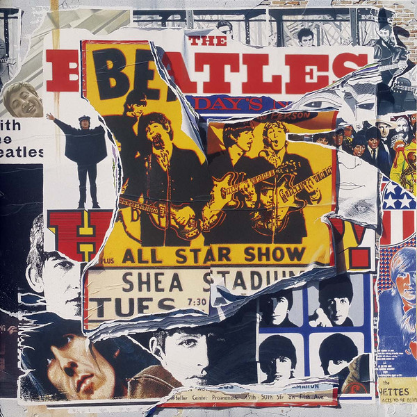

# Anthology 2

By The Beatles

## Album Data

- Catalog #: Roon
- Format: Digital, Album

## Track listing

1-1 Real Love (Recorded in New York, 1979 and Sussex, February 1995)
1-2 Yes It Is (Recorded at EMI Studios, London, 16 February 1965)
1-3 I'm Down (take 1)
1-4 You've Got to Hide Your Love Away (take 5)
1-5 If You've Got Trouble (Recorded at EMI Studios, London, 18 February 1965)
1-6 That Means a Lot (Recorded at EMI Studios, London, 20 February 1965)
1-7 Yesterday (Recorded at EMI Studios, London, 14 February 1965)
1-8 It's Only Love (Recorded at EMI Studios, London, 15 June 1965)
1-9 I Feel Fine (Recorded at ABC Theatre, Blackpool, 1 August 1965)
1-10 Ticket to Ride (Recorded at ABC Theatre, Blackpool, 1 August 1965)
1-11 Yesterday (Recorded at ABC Theatre, Blackpool, 1 August 1965)
1-12 Help! (Recorded at ABC Theatre, Blackpool, 1 August 1965)
1-13 Everybody's Trying to Be My Baby (Recorded at Shea Stadium, New York, 15 August 1965)
1-14 Norwegian Wood (This Bird Has Flown) (take 1)
1-15 I'm Looking Through You (Recorded at EMI Studios, London, 24 October 1965)
1-16 12-Bar Original (Recorded at EMI Studios, London, 4 November 1965)
1-17 Tomorrow Never Knows (take 1)
1-18 Got to Get You Into My Life (take 5)
1-19 And Your Bird Can Sing (take 2)
1-20 Taxman (take 11)
1-21 Eleanor Rigby (strings only)
1-22 I'm Only Sleeping (rehearsal)
1-23 I'm Only Sleeping (take 1)
1-24 Rock & Roll Music
1-25 She's a Woman (live from Nippon Budokan Hall, Tokyo, Japan/1966)
2-1 Strawberry Fields Forever (demo sequence)
2-2 Strawberry Fields Forever (take 1)
2-3 Strawberry Fields Forever (take 7 & edit piece)
2-4 Penny Lane (alternate mix)
2-5 A Day in the Life
2-6 Good Morning, Good Morning (take 8)
2-7 Only a Northern Song
2-8 Being for the Benefit of Mr. Kite! (takes 1 and 2)
2-9 Being for the Benefit of Mr. Kite! (take 7)
2-10 Lucy in the Sky With Diamonds (alternate mix)
2-11 Within You, Without You
2-12 Sgt. Pepper's Lonely Hearts Club Band (reprise)
2-13 You Know My Name (Look Up the Number)
2-14 I Am the Walrus (take 16)
2-15 The Fool on the Hill (demo)
2-16 Your Mother Should Know (take 27)
2-17 The Fool on the Hill (take 4)
2-18 Hello Goodbye
2-19 Lady Madonna (alternate mix)
2-20 Across the Universe (take 2)

