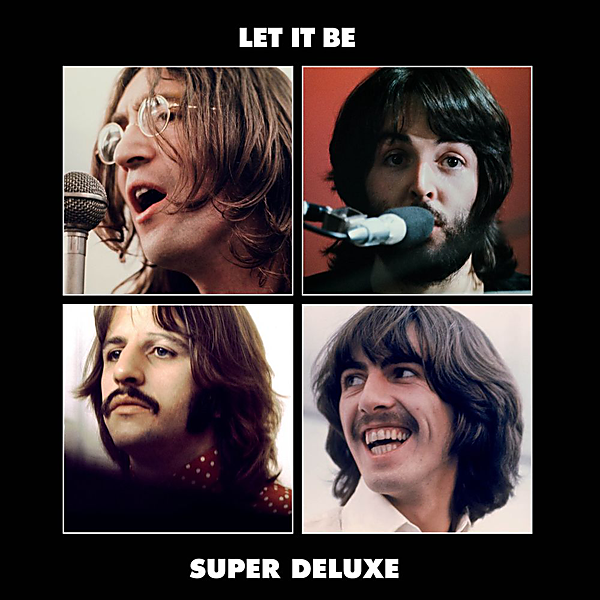

# Let It Be (Super Deluxe)

By The Beatles

## Album Data

- Catalog #: Roon
- Format: Digital, Album

## Track listing

1-1 Two of Us (2021 mix)
1-2 Dig a Pony (2021 mix)
1-3 Across the Universe (2021 mix)
1-4 I Me Mine (2021 mix)
1-5 Dig It (2021 mix)
1-6 Let It Be (2021 mix)
1-7 Maggie Mae (2021 mix)
1-8 I've Got a Feeling (2021 mix)
1-9 One After 909 (2021 mix)
1-10 The Long and Winding Road (2021 mix)
1-11 For You Blue (2021 mix)
1-12 Get Back (2021 mix)
2-1 Morning Camera (Speech) [Mono]/Two of Us [Take 4]
2-2 Maggie Mae/Fancy My Chances With You [Mono]
2-3 Can You Dig It?
2-4 I Don't Know Why I'm Moaning (Speech) [Mono]
2-5 For You Blue [Take 4]
2-6 Let It Be/Please Please Me/Let It Be [Take 10]
2-7 I've Got a Feeling [Take 10]
2-8 Dig a Pony [Take 14]
2-9 Get Back [Take 19]
2-10 Like Making an Album? (speech)
2-11 One After 909 [Take 3]
2-12 Don't Let Me Down [First Rooftop Performance]
2-13 The Long and Winding Road [Take 19]
2-14 Wake Up Little Susie/I Me Mine [Take 11]
3-1 On the Day Shift Now (Speech) [Mono]/All Things Must Pass [Rehearsal, Mono]
3-2 Concentrate on the Sound [Mono]
3-3 Gimme Some Truth [Rehearsal, Mono]
3-4 I Me Mine [Rehearsal, Mono]
3-5 She Came in Through the Bathroom Window [Rehearsal]
3-6 Polythene Pam [Rehearsal, Mono]
3-7 Octopus's Garden [Rehearsal, Mono]
3-8 Oh! Darling (jam)
3-9 Get Back [Take 8]
3-10 The Walk (jam)
3-11 Without a Song (jam)
3-12 Something [Rehearsal, Mono]
3-13 Let It Be [Take 28]
4-1 One After 909 (1969 Glyn Johns mix)
4-2 I'm Ready (aka Rocker)/Save the Last Dance For Me/Don't Let Me Down
4-3 Don't Let Me Down (1969 Glyn Johns mix)
4-4 Dig a Pony (1969 Glyn Johns mix)
4-5 I've Got a Feeling (1969 Glyn Johns mix)
4-6 Get Back (1969 Glyn Johns mix)
4-7 For You Blue (1969 Glyn Johns mix)
4-8 Teddy Boy (1969 Glyn Johns mix)
4-9 Two of Us (1969 Glyn Johns mix)
4-10 Maggie Mae (1969 Glyn Johns mix)
4-11 Dig It (1969 Glyn Johns mix)
4-12 Let It Be (1969 Glyn Johns mix)
4-13 The Long and Winding Road (1969 Glyn Johns mix)
4-14 Get Back (reprise) (1969 Glyn Johns mix)
5-1 Across the Universe [Glyn Johns 1970 Mix]
5-2 I Me Mine [Glyn Johns 1970 Mix]
5-3 Don't Let Me Down [New Mix of Original Single Version]
5-4 Let It Be [New Mix of Original Single Version]

