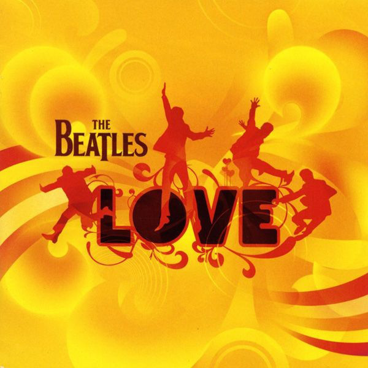

# Love

By The Beatles

## Album Data

- Catalog #: Roon
- Format: Digital, Album

## Track listing

1. Because (Love version)
2. Get Back (Love version)
3. Glass Onion (Love version)
4. Eleanor Rigby/Julia (Transition)
5. I Am the Walrus (Love version)
6. I Want to Hold Your Hand (Love version)
7. Drive My Car/The Word/What You're Doing
8. Gnik Nus (Love version)
9. Something/Blue Jay Way (Transition)
10. Being for the Benefit of Mr. Kite!/I Want You (She's So Heavy)/Helter Skelter
11. Help! (Love version)
12. Blackbird/Yesterday
13. Strawberry Fields Forever (Love version)
14. Within You Without You/Tomorrow Never Knows
15. Lucy in the Sky With Diamonds (Love version)
16. Octopus's Garden (Love version)
17. Lady Madonna (Love version)
18. Here Comes the Sun/The Inner Light (Transition)
19. Come Together/Dear Prudence/Cry Baby Cry (Transition)
20. Revolution (Love version)
21. Back in the U.S.S.R. (Love version)
22. While My Guitar Gently Weeps (Love version)
23. A Day in the Life (Love version)
24. Hey Jude (Love version)
25. Sgt. Pepper's Lonely Hearts Club Band (reprise) (Love version)
26. All You Need Is Love (Love version)
27. The Fool on the Hill (Love version)
28. Girl (Love version)

