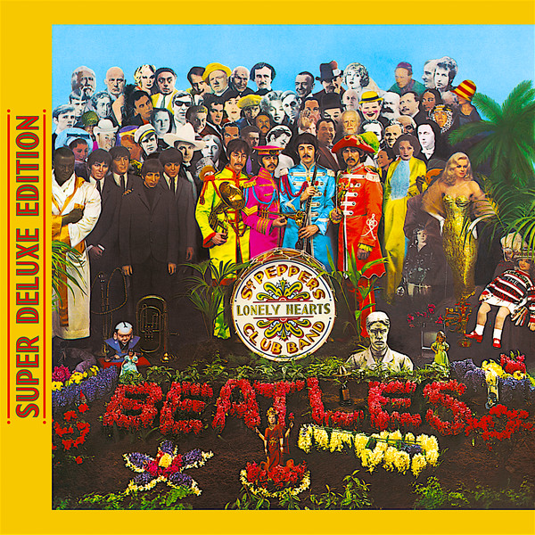

# Sgt. Pepper's Lonely Hearts Club Band (Super Deluxe Edition)

By The Beatles

## Album Data

- Catalog #: Roon
- Format: Digital, Album

## Track listing

1-1 Sgt. Pepper's Lonely Hearts Club Band [2017 Remix]
1-2 With a Little Help From My Friends [2017 Remix]
1-3 Lucy in the Sky with Diamonds[2017 Remix]
1-4 Getting Better [2017 Remix]
1-5 Fixing a Hole [2017 Remix]
1-6 She's Leaving Home [2017 Remix]
1-7 Being for the Benefit of Mr. Kite! [2017 Remix]
1-8 Within You Without You [2017 Remix]
1-9 When I'm Sixty-Four [2017 Remix]
1-10 Lovely Rita [2017 Remix]
1-11 Good Morning Good Morning [2017 Remix]
1-12 Sgt. Pepper's Lonely Hearts Club Band (Reprise) [2017 Remix]
1-13 A Day in the Life [2017 Remix]
2-1 Strawberry Fields Forever (take 1)
2-2 Strawberry Fields Forever (take 4)
2-3 Strawberry Fields Forever (take 7)
2-4 Strawberry Fields Forever (take 26)
2-5 Strawberry Fields Forever (stereo mix 2015)
2-6 When I'm Sixty-Four (take 2)
2-7 Penny Lane
2-8 Penny Lane (vocal overdubs and speech)
2-9 Penny Lane (stereo mix 2017)
2-10 A Day in the Life (take 1)
2-11 A Day in the Life (take 2)
2-12 A Day in the Life (orchestra overdub)
2-13 A Day in the Life (hummed last chord / takes 8, 9, 10 and 11)
2-14 A Day in the Life (the last chord)
2-15 Sgt. Pepper's Lonely Hearts Club Band
2-16 Sgt. Pepper's Lonely Hearts Club Band (take 9 and speech)
2-17 Good Morning Good Morning
2-18 Good Morning Good Morning (take 8)
3-1 Fixing a Hole (take 1)
3-2 Fixing a Hole (speech and take 3)
3-3 Being for the Benefit of Mr. Kite! (speech from before take 1 / take 4 and speech at end)
3-4 Being for the Benefit of Mr. Kite! (take 7)
3-5 Lovely Rita (speech and take 9)
3-6 Lucy in the Sky With Diamonds (take 1 and speech at the end)
3-7 Lucy in the Sky With Diamonds (speech, false start and take 5)
3-8 Getting Better (take 1 and speech at the end)
3-9 Getting Better (take 12)
3-10 Within You Without You (take 1 / Indian instruments)
3-11 Within You Without You (George coaching the musicians)
3-12 She's Leaving Home
3-13 She's Leaving Home
3-14 With A Little Help From My Friends
3-15 Sgt. Pepper's Lonely Hearts Club Band [Reprise]
4-1 Sgt Pepper's Lonely Hearts Club Band
4-2 With A Little Help From My Friends
4-3 Lucy In The Sky With Diamonds
4-4 Getting Better
4-5 Fixing A Hole
4-6 She's Leaving Home
4-7 Being For The Benefit Of Mr Kite!
4-8 Within You Without You
4-9 When I'm Sixty Four
4-10 Lovely Rita
4-11 Good Morning Good Morning
4-12 Sgt Pepper's Lonely Hearts Club Band [Reprise]
4-13 A Day In The Life
4-14 Strawberry Fields Forever (original mono mix)
4-15 Penny Lane (original mono mix)
4-16 A Day in the Life (first mono mix)
4-17 Lucy in the Sky With Diamonds (original mono mix - no. 11)
4-18 She's Leaving Home (first mono mix)
4-19 Penny Lane (Capitol Records mono US promo mix)

