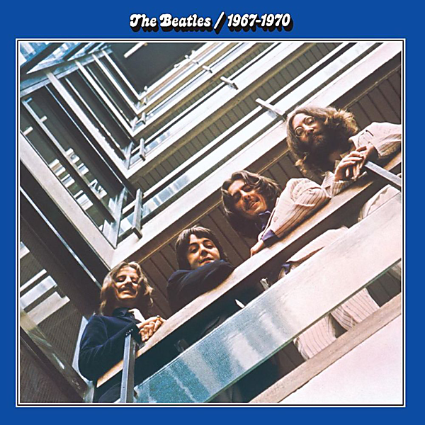

# The Beatles 1967 - 1970 (Remastered)

By The Beatles

## Album Data

- Catalog #: Roon
- Format: Digital, Album

## Track listing

1-1 Strawberry Fields Forever
1-2 Penny Lane
1-3 Sgt. Pepper's Lonely Hearts Club Band
1-4 With a Little Help from My Friends
1-5 Lucy in the Sky with Diamonds
1-6 A Day in the Life
1-7 All You Need Is Love
1-8 I Am the Walrus
1-9 Hello, Goodbye
1-10 The Fool on the Hill
1-11 Magical Mystery Tour
1-12 Lady Madonna
1-13 Hey Jude
1-14 Revolution
2-1 Back in the U.S.S.R.
2-2 While My Guitar Gently Weeps
2-3 Ob-La-Di, Ob-La-Da
2-4 Get Back
2-5 Don't Let Me Down
2-6 The Ballad of John and Yoko
2-7 Old Brown Shoe
2-8 Here Comes the Sun
2-9 Come Together
2-10 Something
2-11 Octopus's Garden
2-12 Let It Be
2-13 Across the Universe
2-14 The Long and Winding Road

