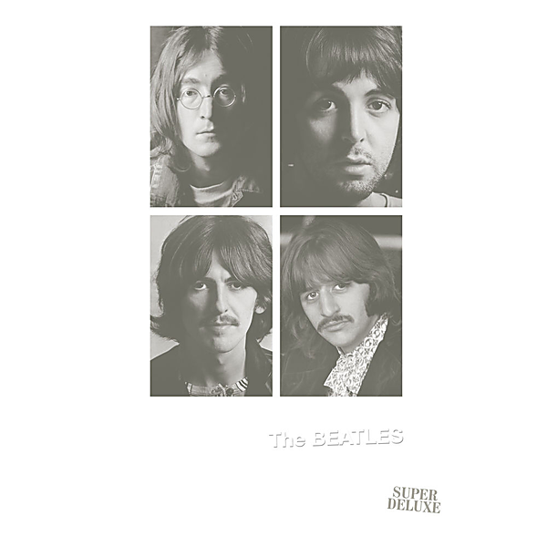

# The Beatles (White Album) [Super Deluxe] (White Album / Super Deluxe)

By The Beatles

## Album Data

- Catalog #: Roon
- Format: Digital, Album

## Track listing

1-1 Back in the U.S.S.R. (2018 mix)
1-2 Dear Prudence (2018 mix)
1-3 Glass Onion (2018 mix)
1-4 Ob-La-Di, Ob-La-Da
1-5 Wild Honey Pie (2018 mix)
1-6 The Continuing Story of Bungalow Bill (2018 mix)
1-7 While My Guitar Gently Weeps (2018 mix)
1-8 Happiness Is a Warm Gun (2018 mix)
1-9 Martha My Dear (2018 mix)
1-10 I'm So Tired (2018 mix)
1-11 Blackbird (2018 mix)
1-12 Piggies (2018 mix)
1-13 Rocky Raccoon (2018 mix)
1-14 Don't Pass Me By (2018 mix)
1-15 Why Don't We Do It in the Road? (2018 mix)
1-16 I Will (2018 mix)
1-17 Julia (2018 mix)
2-1 Birthday (2018 mix)
2-2 Yer Blues (2018 mix)
2-3 Mother Nature's Son (2018 mix)
2-4 Everybody's Got Something to Hide Except Me and My Monkey (2018 mix)
2-5 Sexy Sadie (2018 mix)
2-6 Helter Skelter (2018 mix)
2-7 Long, Long, Long (2018 mix)
2-8 Revolution 1 (2018 mix)
2-9 Honey Pie (2018 mix)
2-10 Savoy Truffle (2018 mix)
2-11 Cry Baby Cry (2018 mix)
2-12 Revolution 9 (2018 mix)
2-13 Good Night (2018 mix)
3-1 Back in the U.S.S.R. [Esher Demo]
3-2 Dear Prudence [Esher Demo]
3-3 Glass Onion [Esher Demo]
3-4 Ob-La-Di, Ob-La-Da [Esher Demo]
3-5 The Continuing Story of Bungalow Bill [Esher Demo]
3-6 While My Guitar Gently Weeps [Esher Demo]
3-7 Happiness is a Warm Gun [Esher Demo]
3-8 I'm So Tired [Esher Demo]
3-9 Blackbird [Esher Demo]
3-10 Piggies [Esher Demo]
3-11 Rocky Raccoon [Esher Demo]
3-12 Julia [Esher Demo]
3-13 Yer Blues [Esher Demo]
3-14 Mother Nature's Son [Esher Demo]
3-15 Everybody's Got Something to Hide Except Me and My Monkey [Esher Demo]
3-16 Sexy Sadie [Esher Demo]
3-17 Revolution [Esher Demo]
3-18 Honey Pie [Esher Demo]
3-19 Cry Baby Cry [Esher Demo]
3-20 Sour Milk Sea [Esher Demo]
3-21 Junk [Esher Demo]
3-22 Child of Nature [Esher Demo]
3-23 Circles [Esher Demo]
3-24 Mean Mr Mustard [Esher Demo]
3-25 Polythene Pam [Esher Demo]
3-26 Not Guilty [Esher Demo]
3-27 What's the New Mary Jane [Esher Demo]
4-1 Revolution 1 (take 18)
4-2 A Beginning [Take 4]/Don't Pass Me By [Take 7]
4-3 Blackbird (take 28)
4-4 Everybody's Got Something to Hide Except Me and My Monkey (unnumbered rehearsal)
4-5 Good Night (unnumbered rehearsal)
4-6 Good Night (take 10 with a guitar part from take 5)
4-7 Good Night (take 22)
4-8 Ob-La-Di, Ob-La-Da
4-9 Revolution (unnumbered rehearsal)
4-10 Revolution
4-11 Cry Baby Cry (unnumbered rehearsal)
4-12 Helter Skelter (first version – take 2)
5-1 Sexy Sadie (take 3)
5-2 While My Guitar Gently Weeps (acoustic version – take 2)
5-3 Hey Jude (take 1)
5-4 St Louis Blues
5-5 Not Guilty (take 102)
5-6 Mother Nature's Son (take 15)
5-7 Yer Blues (take 5 with guide vocal)
5-8 What's the New Mary Jane (take 1)
5-9 Rocky Raccoon (take 8)
5-10 Back in the U.S.S.R.
5-11 Dear Prudence (vocal, guitar & drums)
5-12 Let It Be (unnumbered rehearsal)
5-13 While My Guitar Gently Weeps (third version – take 27)
5-14 (You're So Square) Baby I Don't Care (studio jam)
5-15 Helter Skelter (second version – take 17)
5-16 Glass Onion (take 10)
6-1 I Will (take 13)
6-2 Blue Moon (studio jam)
6-3 I Will (take 29)
6-4 Step Inside Love (studio jam)
6-5 Los Paranoias (studio jam)
6-6 Can You Take Me Back? (take 1)
6-7 Birthday
6-8 Piggies
6-9 Happiness Is a Warm Gun (take 19)
6-10 Honey Pie
6-11 Savoy Truffle
6-12 Martha My Dear (without brass and strings)
6-13 Long, Long, Long (take 44)
6-14 I'm So Tired (take 7)
6-15 I'm So Tired (take 14)
6-16 The Continuing Story of Bungalow Bill (take 2)
6-17 Why Don't We Do It in the Road? (take 5)
6-18 Julia (two rehearsals)
6-19 The Inner Light
6-20 Lady Madonna (take 2 – piano and drums)
6-21 Lady Madonna (backing vocals from take 3)
6-22 Across the Universe (take 6)

