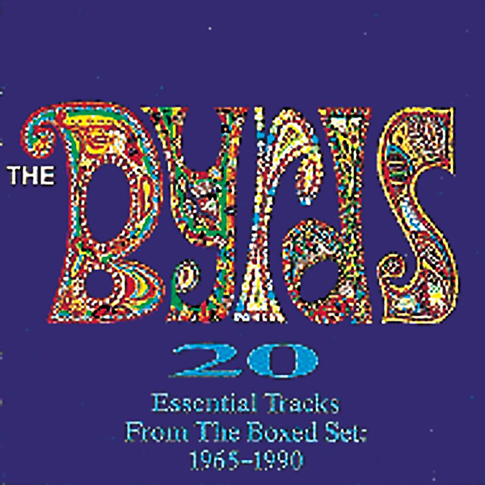

# 20 Essential Tracks From The Box Set: 1965-1990

By The Byrds

## Album Data

- Catalog #: Roon
- Format: Digital, Album

## Track listing

1. Mr. Tambourine Man
2. I'll Feel a Whole Lot Better
3. All I Really Want to Do
4. Turn! Turn! Turn! (To Everything There Is a Season)
5. 5D (Fifth Dimension)
6. Eight Miles High
7. Mr. Spaceman
8. So You Want to Be a Rock 'N' Roll Star
9. Have You Seen Her Face
10. Lady Friend
11. My Back Pages
12. Goin' Back [LP Version]
13. The Ballad of Easy Rider
14. Jesus Is Just Alright
15. Chestnut Mare
16. I Wanna Grow Up to Be a Politician
17. He Was a Friend of Mine
18. Paths of Victory
19. From a Distance
20. Love That Never Dies

