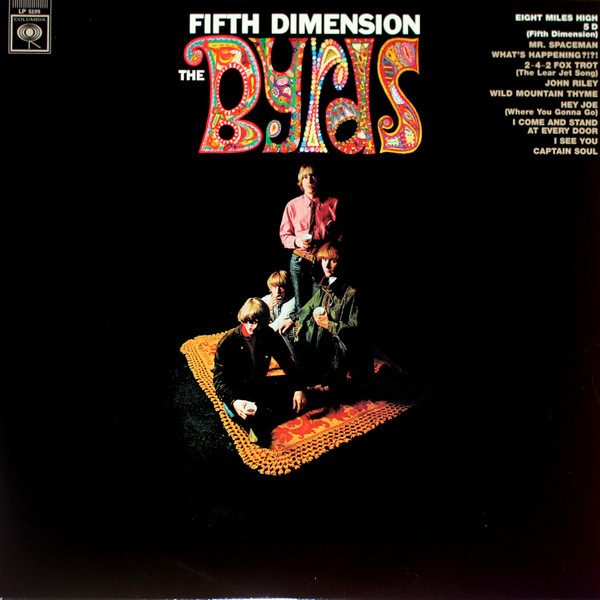

# Fifth Dimension

By The Byrds

## Album Data

- Catalog #: Roon
- Format: Digital, Album

## Track listing

1. 5D (Fifth Dimension)
2. Wild Mountain Thyme
3. Mr. Spaceman
4. I See You
5. What's Happening?!?!
6. I Come and Stand at Every Door
7. Eight Miles High
8. Hey Joe (Where You Gonna Go)
9. Captain Soul
10. John Riley
11. 2-4-2 Fox Trot (The Lear Jet Song)
12. Why
13. I Know My Rider (I Know You Rider)
14. Psychodrama City
15. Eight Miles High [Alt. Version]
16. Why (3)
17. John Riley (2)

## See also

- [20 Essential Tracks From The Box Set](20_Essential_Tracks_From_The_Box_Set-_1965-1990.md)
- [Greatest Hits](Greatest_Hits.md)
- [Mr. Tambourine Man](Mr_Tambourine_Man.md)
- [Sweetheart Of The Rodeo (Legacy Edition)](Sweetheart_Of_The_Rodeo_Legacy_Edition.md)
- [The Byrds](The_Byrds.md)
- [The Notorious Byrd Brothers](The_Notorious_Byrd_Brothers.md)
- [Turn! Turn! Turn!](Turn!_Turn!_Turn!.md)
- [Younger Than Yesterday](Younger_Than_Yesterday.md)
- [Beets: Byrds](../../Beets/The_Byrds/Byrds.md)
- [Beets: Mr. Tambourine Man](../../Beets/The_Byrds/Mr_Tambourine_Man.md)
- [Beets: On the Wyng - Early Studio Demos](../../Beets/The_Byrds/On_the_Wyng_-_Early_Studio_Demos.md)
- [Beets: The Byrds' Greatest Hits](../../Beets/The_Byrds/The_Byrds_Greatest_Hits.md)
- [Beets: The Notorious Byrd Brothers](../../Beets/The_Byrds/The_Notorious_Byrd_Brothers.md)
- [Beets: Turn! Turn! Turn!](../../Beets/The_Byrds/Turn!_Turn!_Turn!.md)
- [Beets: Younger Than Yesterday](../../Beets/The_Byrds/Younger_Than_Yesterday.md)
