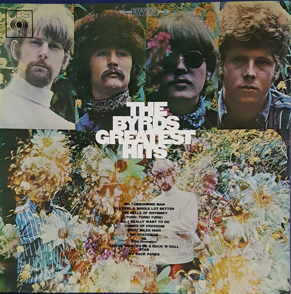

# Greatest Hits

By The Byrds

## Album Data

- Catalog #: Roon
- Format: Digital, Album

## Track listing

1. Mr. Tambourine Man
2. I'll Feel a Whole Lot Better
3. The Bells of Rhymney
4. Turn! Turn! Turn! (To Everything There Is a Season)
5. All I Really Want to Do
6. Chimes of Freedom
7. Eight Miles High
8. Mr. Spaceman
9. 5D (Fifth Dimension)
10. So You Want to Be a Rock 'N' Roll Star
11. My Back Pages
12. It Won't Be Wrong
13. Set You Free This Time
14. Have You Seen Her Face

## See also

- [20 Essential Tracks From The Box Set](20_Essential_Tracks_From_The_Box_Set-_1965-1990.md)
- [Fifth Dimension](Fifth_Dimension.md)
- [Mr. Tambourine Man](Mr_Tambourine_Man.md)
- [Sweetheart Of The Rodeo (Legacy Edition)](Sweetheart_Of_The_Rodeo_Legacy_Edition.md)
- [The Byrds](The_Byrds.md)
- [The Notorious Byrd Brothers](The_Notorious_Byrd_Brothers.md)
- [Turn! Turn! Turn!](Turn!_Turn!_Turn!.md)
- [Younger Than Yesterday](Younger_Than_Yesterday.md)
- [Beets: Byrds](../../Beets/The_Byrds/Byrds.md)
- [Beets: Mr. Tambourine Man](../../Beets/The_Byrds/Mr_Tambourine_Man.md)
- [Beets: On the Wyng - Early Studio Demos](../../Beets/The_Byrds/On_the_Wyng_-_Early_Studio_Demos.md)
- [Beets: The Byrds' Greatest Hits](../../Beets/The_Byrds/The_Byrds_Greatest_Hits.md)
- [Beets: The Notorious Byrd Brothers](../../Beets/The_Byrds/The_Notorious_Byrd_Brothers.md)
- [Beets: Turn! Turn! Turn!](../../Beets/The_Byrds/Turn!_Turn!_Turn!.md)
- [Beets: Younger Than Yesterday](../../Beets/The_Byrds/Younger_Than_Yesterday.md)
