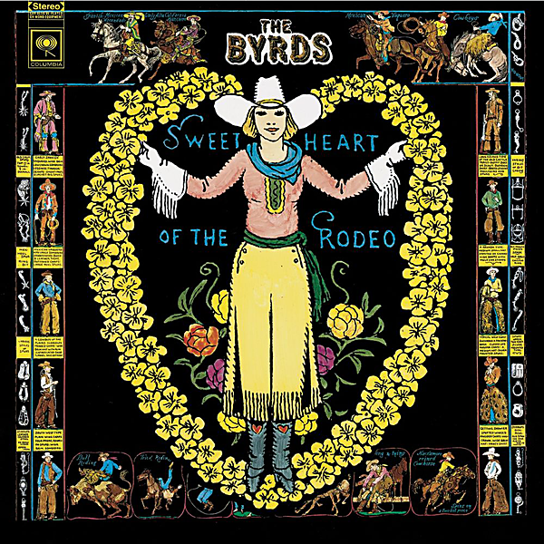

# Sweetheart Of The Rodeo (Legacy Edition)

By The Byrds

## Album Data

- Catalog #: Roon
- Format: Digital, Album

## Track listing

1-1 You Ain't Going Nowhere
1-2 I Am a Pilgrim
1-3 The Christian Life
1-4 You Don't Miss Your Water
1-5 You're Still on My Mind
1-6 Pretty Boy Floyd
1-7 Hickory Wind
1-8 One Hundred Years from Now
1-9 Blue Canadian Rockies
1-10 Life in Prison
1-11 Nothing Was Delivered
1-12 All I Have Are Memories [Master Take] [Kevin Kelley Vocal]
1-13 Reputation
1-14 Pretty Polly
1-15 Lazy Days
1-16 The Christian Life (Gram Parsons vocal)
1-17 You Don't Miss Your Water (Gram Parsons vocal)
1-18 One Hundred Years From Now (Gram Parsons vocal)
1-19 Radio Spot: Sweetheart of the Radio Album
2-1 Sum Up Broke
2-2 One Day Week
2-3 Truck Drivin' Man
2-4 Blue Eyes
2-5 Luxury Liner
2-6 Strong Boy
2-7 Lazy Days [Alternate Version]
2-8 Pretty Polly [Alternate Version]
2-9 Hickory Wind [Alternate "Nashville" Version] [Take 8]
2-10 The Christian Life [Rehearsal Version] [Take 7] [Gram Parsons Vocal]
2-11 The Christian Life [Rehearsal Version] [Take 8] [Gram Parsons Vocal]
2-12 Life in Prison [Rehearsal Version] [Takes 1 & 2] [Gram Parsons Vocal]
2-13 Life in Prison [Rehearsal Version] [Takes 3 & 4] [Gram Parsons Vocal]
2-14 One Hundred Years From Now [Rehearsal Version] [Takes 12 & 13] [Gram Parsons Vocal]
2-15 One Hundred Years From Now [Rehearsal Version] [Takes 14 & 15] [Gram Parsons Vocal]
2-16 You're Still on My Mind [Rehearsal Version] [Take 13] [Gram Parsons Vocal]
2-17 You're Still on My Mind [Rehearsal Version] [Take 48] [Gram Parsons Vocal]
2-18 All I Have Are Memories
2-19 All I Have Are Memories
2-20 Blue Canadian Rockies [Rehearsal Version] [Take 14]

