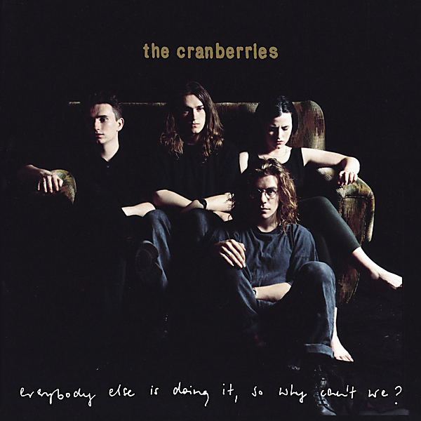

# Everybody Else Is Doing It, So Why Can't We? (Super Deluxe)

By The Cranberries

## Album Data

- Catalog #: Roon
- Format: Digital, Album

## Track listing

1-1 I Still Do
1-2 Dreams
1-3 Sunday
1-4 Pretty
1-5 Waltzing Back
1-6 Not Sorry
1-7 Linger
1-8 Wanted
1-9 Still Can't...
1-10 I Will Always
1-11 How
1-12 Put Me Down
2-1 Íosa
2-2 What You Were [Demo]
2-3 Linger [Dave Bascombe Mix]
2-4 How [Alternate Version]
2-5 Liar
2-6 What You Were
2-7 Reason
2-8 How [Radical Mix]
2-9 Them
2-10 Pretty [Prêt-à-Porter Movie Remix]
2-11 Uncertain
2-12 Nothing Left at All
2-13 Pathetic Senses
2-14 Them [Xeric]
2-15 Dreams [Unmixed Early Demo]
2-16 Sunday [Early Demo]
2-17 Linger [Early Demo]
2-18 Chrome Paint [Early Demo]
2-19 Fast One [Early Demo]
2-20 Shine Down [Early Demo]
2-21 Dreams [Pop Mix–Early Demo]
3-1 Put Me Down (live at Cork Rock, June 1, 1991)
3-2 Dreams (live at Cork Rock, June 1, 1991)
3-3 Uncertain (live at Cork Rock, June 1, 1991)
3-4 Pretty (live at Féile, Tipperary, July 31, 1994)
3-5 Wanted (live at Féile, Tipperary, July 31, 1994)
3-6 Daffodil Lament (live at Féile, Tipperary, July 31, 1994)
3-7 Linger (live at Féile, Tipperary, July 31, 1994)
3-8 I Can't Be With You (live at Féile, Tipperary, July 31, 1994)
3-9 How (live at Féile, Tipperary, July 31, 1994)
3-10 Ode to My Family (live at Féile, Tipperary, July 31, 1994)
3-11 Not Sorry (live at Féile, Tipperary, July 31, 1994)
3-12 Waltzing Back (live at Féile, Tipperary, July 31, 1994)
3-13 Dreams (live at Féile, Tipperary, July 31, 1994)
3-14 Ridiculous Thoughts (live at Féile, Tipperary, July 31, 1994)
3-15 Zombie (live at Féile, Tipperary, July 31, 1994)
3-16 (They Long to Be) Close to You (live at Féile, Tipperary, July 31, 1994)
4-1 Dreams [RTÉ Radio Dave Fanning Session 1991]
4-2 Uncertain [RTÉ Radio Dave Fanning Session 1991]
4-3 Reason [RTÉ Radio Dave Fanning Session 1991]
4-4 Put Me Down [RTÉ Radio Dave Fanning Session 1991]
4-5 Waltzing Back [BBC Radio 1 John Peel Session 1992]
4-6 Linger [BBC Radio 1 John Peel Session 1992]
4-7 Wanted [BBC Radio 1 John Peel Session 1992]
4-8 I Will Always [BBC Radio 1 John Peel Session 1992]
4-9 The Icicle Melts [RTÉ Radio Dave Fanning Session 1993]
4-10 Wanted [RTÉ Radio Dave Fanning Session 1993]
4-11 Like You Used To [RTÉ Radio Dave Fanning Session 1993]
4-12 False [RTÉ Radio Dave Fanning Session 1993]

