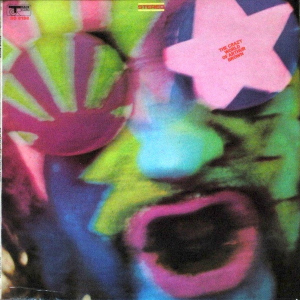

# The Crazy World of Arthur Brown

By The Crazy World of Arthur Brown

## Album Data

- Catalog #: Roon
- Format: Digital, Album

## Track listing

1-1 Prelude/Nightmare
1-2 Fanfare-Fire Poem
1-3 Fire
1-4 Come and Buy
1-5 Time/Confusion
1-6 I Put a Spell on You
1-7 Spontaneous Apple Creation
1-8 Rest Cure
1-9 I've Got Money
1-10 Child of My Kingdom
2-1 Devil's Grip (A side of single)
2-2 Give Him a Flower (B side of single)
2-3 Music Man [Stereo Mix]
2-4 Fire [First Version]
2-5 Nightmare (Prelude) [Alternate Mono Mix]
2-6 Fanfare/Fire Poem [Alternate Mono Mix]
2-7 Fire [Alternate Mono Mix]
2-8 Come & Buy [Alternate Mono Mix]
2-9 Time/Confusion [Alternate Mono Mix]
2-10 Interview With Brian Matthew [Live BBC Radio One Session]
2-11 Fire Poem/Fire [Live BBC Radio One Session]
2-12 Come & Buy [Live BBC Radio One Session]
2-13 Nightmare [From the Film 'The Committee']

