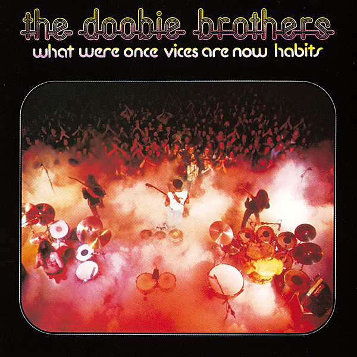

# What Were Once Vices Are Now Habits (2016 Remaster)

By The Doobie Brothers

## Album Data

- Catalog #: Roon
- Format: Digital, Album

## Track listing

1. Song to See You Through (2016 Remaster)
2. Spirit (2016 Remaster)
3. Pursuit on 53rd St. (2016 Remaster)
4. Black Water (2016 Remaster)
5. Eyes of Silver (2016 Remaster)
6. Road Angel (2016 Remaster)
7. You Just Can't Stop It (2016 Remaster)
8. Tell Me What You Want (And I'll Give You What You Need) [2016 Remaster]
9. Down in the Track (2016 Remaster)
10. Another Park, Another Sunday (2016 Remaster)
11. Daughters of the Sea (2016 Remaster)
12. Flying Cloud (2016 Remaster)

