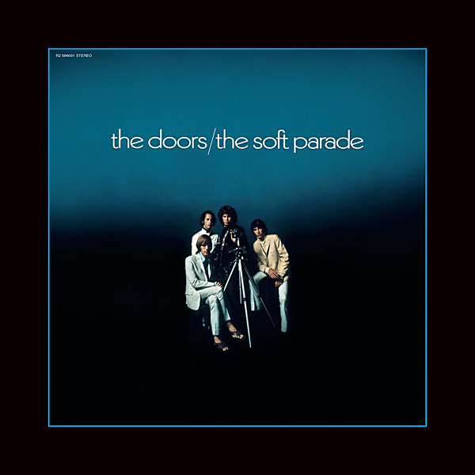

# The Soft Parade (50th Anniversary Deluxe Edition)

By The Doors

## Album Data

- Catalog #: Roon
- Format: Digital, Album

## Track listing

1-1 Tell All the People
1-2 Touch Me
1-3 Shaman's Blues
1-4 Do It
1-5 Wild Child
1-6 Wild Child
1-7 Runnin' Blue
1-8 Wishful Sinful
1-9 The Soft Parade
1-10 Who Scared You [B-Side]
2-1 Tell All the People [Doors Only Mix]
2-2 Touch Me [Doors Only Mix w/Robby Krieger Guitar Overdub]
2-3 Runnin' Blue [Doors Only Mix w/Robby Krieger Guitar Overdub]
2-4 Wishful Sinful [Doors Only Mix w/Robby Krieger Guitar Overdub]
2-5 Who Scared You [Doors Only Mix]
2-6 Roadhouse Blues [Screamin' Ray Daniels a.k.a. Ray Manzarek on Vocals]
2-7 (You Need Meat) Don't Go No Further [Screamin' Ray Daniels a.k.a. Ray Manzarek on Vocals]
2-8 I'm Your Doctor [Screamin' Ray Daniels a.k.a. Ray Manzarek on Vocals]
2-9 Touch Me [Doors Only Mix]
2-10 Runnin' Blue [Doors Only Mix]
2-11 Wishful Sinful [Doors Only Mix]
3-1 I Am Troubled
3-2 Seminary School (aka "Petition the Lord With Prayer")
3-3 Rock Is Dead [Complete Version]
3-4 Chaos

