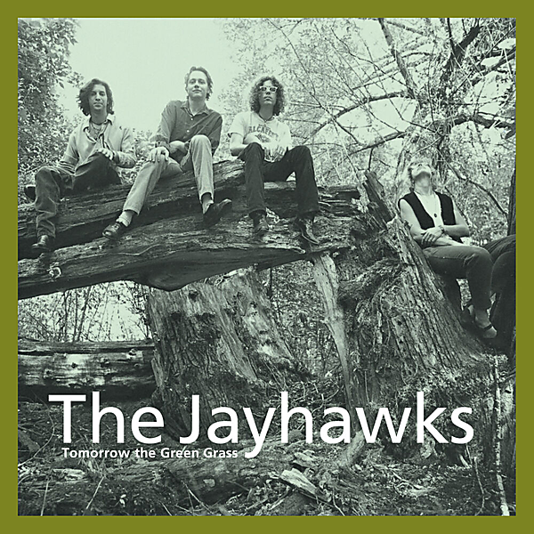

# Tomorrow The Green Grass (Legacy Edition)

By The Jayhawks

## Album Data

- Catalog #: Roon
- Format: Digital, Album

## Track listing

1-1 Blue
1-2 I'd Run Away
1-3 Miss Williams' Guitar
1-4 Two Hearts
1-5 Real Light
1-6 Over My Shoulder
1-7 Bad Time
1-8 See Him on the Street
1-9 Nothing Left to Borrow
1-10 Ann Jane
1-11 Pray for Me
1-12 Red's Song
1-13 Ten Little Kids
1-14 Tomorrow the Green Grass
1-15 You and I (Ba-Ba-Ba)
1-16 Sweet Hobo Self
1-17 Last Cigarette
1-18 Sleep While You Can
2-1 Pray for Me [Mystery Demo]
2-2 Won't Be Coming Home [Mystery Demo]
2-3 No Place [Mystery Demo]
2-4 Precious Time [Mystery Demo]
2-5 Poor Michaels Boat [Mystery Demo]
2-6 Ranch House In Phoenix [Mystery Demo]
2-7 Cotton Dress [Mystery Demo]
2-8 She Picks the Violets [Mystery Demo]
2-9 Bloody Hands [Mystery Demo]
2-10 Up Above the River [Mystery Demo]
2-11 Over My Shoulder [Mystery Demo]
2-12 Blue From Now On [Mystery Demo]
2-13 Hold Me Close [Mystery Demo]
2-14 Turn Your Pretty Name Around [Mystery Demo]
2-15 You and I (Ba-Ba-Ba) [Mystery Demo]
2-16 Red's Song [Mystery Demo]
2-17 Nothing Left to Borrow [Mystery Demo]
2-18 White Shell Road [Mystery Demo]

