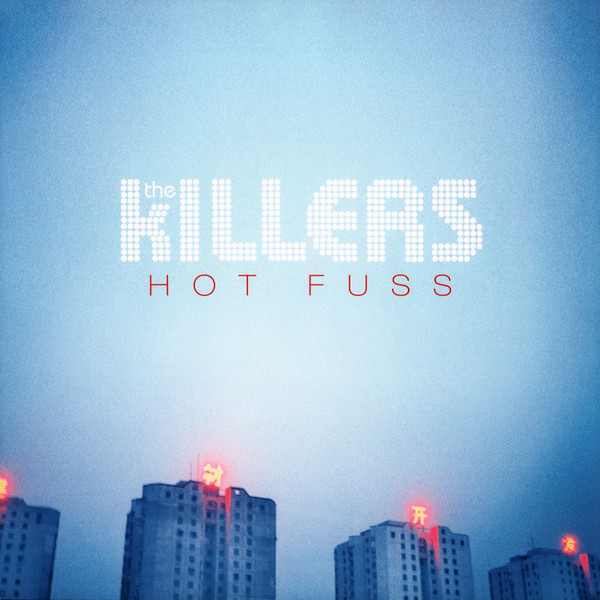

# Hot Fuss

By The Killers

## Album Data

- Catalog #: Roon
- Format: Digital, Album

## Track listing

1. Jenny Was a Friend of Mine
2. Mr. Brightside
3. Smile Like You Mean It
4. Somebody Told Me
5. All These Things That I've Done
6. Andy, You're a Star
7. On Top
8. Change Your Mind [Album Version]
9. Believe Me Natalie
10. Midnight Show
11. Everything Will Be Alright
12. Glamorous Indie Rock & Roll

## See also

- [Day & Age (Bonus Tracks)](Day_and_Age_Bonus_Tracks.md)
- [Imploding The Mirage (Deluxe)](Imploding_The_Mirage_Deluxe.md)
- [Sam's Town](Sams_Town.md)
- [Beets: Day & Age](../../Beets/The_Killers/Day_and_Age.md)
- [Beets: Hot Fuss](../../Beets/The_Killers/Hot_Fuss.md)
- [Beets: Live From the Royal Albert Hall](../../Beets/The_Killers/Live_From_the_Royal_Albert_Hall.md)
- [Beets: Sam’s Town](../../Beets/The_Killers/Sam’s_Town.md)
- [Beets: Sawdust](../../Beets/The_Killers/Sawdust.md)
