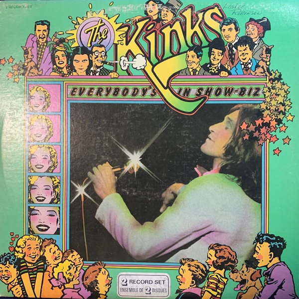

# Everybody's in Show-Biz

By The Kinks

## Album Data

- Catalog #: Roon
- Format: Digital, Album

## Track listing

1. Here Comes Yet Another Day
2. Maximum Consumption
3. Unreal Reality
4. Hot Potatoes
5. Sitting In My Hotel
6. Motorway
7. You Don't Know My Name
8. Supersonic Rocket Ship
9. Look A Little On The Sunnyside
10. Celluloid Heroes
11. Top of the Pops (live at Carnegie Hall, New York, 3rd March 1972)
12. Brainwashed (live at Carnegie Hall, New York, 3rd March 1972)
13. Mr. Wonderful (live at Carnegie Hall, New York, 3rd March 1972)
14. Acute Schizophrenia Paranoia Blues (live at Carnegie Hall, New York, 3rd March 1972)
15. Holiday (live at Carnegie Hall, New York, 3rd March 1972)
16. Muswell Hillbilly (live at Carnegie Hall, New York, 3rd March 1972)
17. Alcohol (live at Carnegie Hall, New York, 3rd March 1972)
18. The Banana Boat Song (Day-O)
19. Skin and Bone (live at Carnegie Hall, New York, 3rd March 1972)
20. Baby Face (live at Carnegie Hall, New York, 3rd March 1972)
21. Lola (live at Carnegie Hall, New York, 3rd March 1972)

