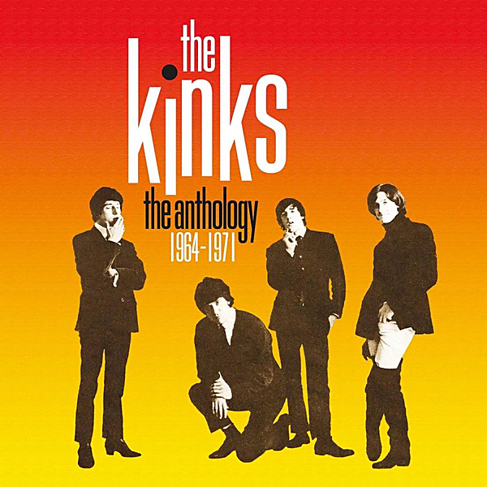

# The Anthology 1964-1971

By The Kinks

## Album Data

- Catalog #: Roon
- Format: Digital, Album

## Track listing

1-1 I Took My Baby Home
1-2 I'm a Hog for You, Baby
1-3 I Don't Need You Anymore [Demo]
1-4 Ev'rybody's Gonna Be Happy [Demo]
1-5 Long Tall Sally
1-6 You Still Want Me
1-7 You Do Something to Me
1-8 You Really Got Me
1-9 It's All Right
1-10 Beautiful Delilah [Alternate Mono Mix]
1-11 Just Can't Go to Sleep
1-12 I'm a Lover, Not a Fighter [Alternate Mono Mix]
1-13 Little Queenie [Live at the Playhouse Theatre, 1964]
1-14 Too Much Monkey Business [Alternate Take]
1-15 Stop Your Sobbing
1-16 All Day and All of the Night
1-17 I Gotta Move
1-18 I Gotta Go Now
1-19 I've Got That Feeling [Live at Piccadilly Studios, 1964]
1-20 Tired of Waiting for You
1-21 Come on Now [Alternate Mix]
1-22 Look for Me Baby
1-23 Nothin' in the World Can Stop Me Worryin' 'Bout That Girl
1-24 Wonder Where My Baby Is Tonight
1-25 Don't Ever Change
1-26 You Shouldn't Be Sad
1-27 Something Better Beginning
1-28 Ev'rybody's Gonna Be Happy
1-29 Who'll Be the Next in Line [Session Excerpt: Backing Track Take One]
1-30 Who'll Be the Next in Line [Alternate Mix]
1-31 Set Me Free
1-32 I Need You
1-33 Interview: Clay Cole Meets the Kinks
2-1 See My Friends
2-2 Never Met a Girl Like You Before
2-3 I Go to Sleep [Demo]
2-4 A Little Bit of Sunlight [Demo]
2-5 Tell Me Now So I'll Know [Alternate Demo]
2-6 When I See That Girl of Mine [Demo]
2-7 There's a New World Just Opening for Me [Demo]
2-8 This Strange Effect [Live at Aeolian Hall, 1965]
2-9 Hide and Seek [Live at Aeolian Hall, 1965]
2-10 A Well Respected Man
2-11 Such a Shame
2-12 Don't You Fret
2-13 Till the End of the Day
2-14 Where Have All the Good Times Gone
2-15 Milk Cow Blues
2-16 I Am Free
2-17 The World Keeps Going Round
2-18 I'm on an Island
2-19 You Can't Win
2-20 Time Will Tell
2-21 Dedicated Follower of Fashion [Session Excerpt: Takes 1-3]
2-22 Dedicated Follower of Fashion [Single Version]
2-23 Sittin' on My Sofa
2-24 She's Got Everything [Backing Track Take Two]
2-25 She's Got Everything [Alternate Mono Mix]
2-26 Mr. Reporter [Version One]
2-27 All Night Stand [Demo]
4-1 Autumn Almanac
4-2 Lavender Hill
4-3 Rosemary Rose (previously unissued mix)
4-4 Wonderboy
4-5 Polly
4-6 Lincoln County [Single Version]
4-7 Did You See His Name? [Altnerate Ending]
4-8 Days [Session Excerpt]
4-9 Days
4-10 Misty Water [Alternate Mix]
4-11 Do You Remember Walter
4-12 Picture Book
4-13 Johnny Thunder [Session Excerpt]
4-14 Johnny Thunder [Stereo Remix]
4-15 Big Sky
4-16 Animal Farm
4-17 Starstruck
4-18 Pictures in the Sand
4-19 People Take Pictures of Each Other [European Stereo Mix]
4-20 Interview: Ray Davies Talks About Village Green Preservation Society
4-21 Village Green Preservation Society [Live at the Playhouse Theatre, 1968]
4-22 Hold My Hand
4-23 Creeping Jean
4-24 Berkeley Mews
4-25 Till Death Us Do Part
4-26 When I Turn Off the Living Room Light
4-27 Where Did My Spring Go
4-28 Plastic Man
4-29 King Kong
4-30 This Man He Weeps Tonight
4-31 Reprise Us Tour Spot

