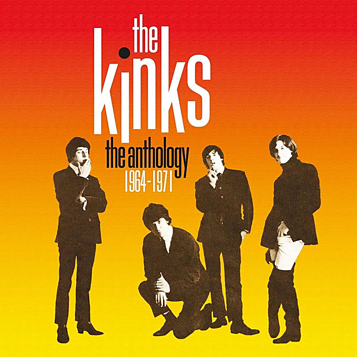

# The Anthology 1964 - 1971 (2014 Remastered Version)

By The Kinks

## Album Data

- Catalog #: Roon
- Format: Digital, Album

## Track listing

1-1 I Took My Baby Home
1-2 I'm a Hog for You, Baby
1-3 I Don't Need You Anymore [Demo]
1-4 Ev'rybody's Gonna Be Happy [Demo]
1-5 Long Tall Sally
1-6 You Still Want Me
1-7 You Do Something to Me
1-8 You Really Got Me
1-9 It's All Right
1-10 Beautiful Delilah [Alternate Mono Mix]
1-11 Just Can't Go to Sleep
1-12 I'm a Lover, Not a Fighter [Alternate Mono Mix]
1-13 Little Queenie [Live at the Playhouse Theatre, 1964]
1-14 Too Much Monkey Business [Alternate Take]
1-15 Stop Your Sobbing
1-16 All Day and All of the Night
1-17 I Gotta Move
1-18 I Gotta Go Now
1-19 I've Got That Feeling [Live at Piccadilly Studios, 1964]
1-20 Tired of Waiting for You
1-21 Come on Now [Alternate Mix]
1-22 Look for Me Baby
1-23 Nothin' in the World Can Stop Me Worryin' 'Bout That Girl
1-24 Wonder Where My Baby Is Tonight
1-25 Don't Ever Change
1-26 You Shouldn't Be Sad
1-27 Something Better Beginning
1-28 Ev'rybody's Gonna Be Happy
1-29 Who'll Be the Next in Line [Session Excerpt: Backing Track Take One]
1-30 Who'll Be the Next in Line [Alternate Mix]
1-31 Set Me Free
1-32 I Need You
1-33 Interview: Clay Cole Meets the Kinks
2-1 See My Friends
2-2 Never Met a Girl Like You Before
2-3 I Go to Sleep [Demo]
2-4 A Little Bit of Sunlight [Demo]
2-5 Tell Me Now So I'll Know [Alternate Demo]
2-6 When I See That Girl of Mine [Demo]
2-7 There's a New World Just Opening for Me [Demo]
2-8 This Strange Effect [Live at Aeolian Hall, 1965]
2-9 Hide And Seek [Live at Aeolian Hall, 1965]
2-10 A Well Respected Man
2-11 Such a Shame
2-12 Don't You Fret
2-13 Till the End of the Day
2-14 Where Have All the Good Times Gone
2-15 Milk Cow Blues
2-16 I Am Free
2-17 The World Keeps Going Round
2-18 I'm on an Island
2-19 You Can't Win
2-20 Time Will Tell
2-21 Dedicated Follower of Fashion [Session Excerpt: Takes 1-3]
2-22 Dedicated Follower Of Fashion [Single Version]
2-23 Sittin' on My Sofa
2-24 She's Got Everything [Backing Track Take Two]
2-25 She's Got Everything [Alternate Mono Mix]
2-26 Mr. Reporter [Version One]
2-27 All Night Stand [Demo]
3-1 Sunny Afternoon
3-2 I'm Not Like Everybody Else
3-3 Dandy
3-4 Party Line
3-5 Rosy Won't You Please Come Home
3-6 Too Much on My Mind
3-7 Session Man
3-8 Most Exclusive Residence for Sale
3-9 Fancy
3-10 Dead End Street
3-11 Big Black Smoke [Alternate Stereo Mix]
3-12 Mr. Pleasant
3-13 This Is Where I Belong
3-14 Village Green
3-15 Two Sisters
3-16 Waterloo Sunset [Session Excerpt Backing Track Take 2]
3-17 Waterloo Sunset
3-18 Act Nice and Gentle
3-19 Harry Rag [Stereo Session Excerpt]
3-20 Harry Rag
3-21 Death of a Clown
3-22 Love Me Till the Sun Shines
3-23 David Watts
3-24 Tin Soldier Man [Alternate Version]
3-25 Afternoon Tea [Alternate Stereo Mix]
3-26 Funny Face
3-27 Lazy Old Sun [Alternate Stereo Mix]
3-28 Susannah's Still Alive
3-29 Good Luck Charm
4-1 Autumn Almanac
4-2 Lavender Hill
4-3 Rosemary Rose
4-4 Wonderboy
4-5 Polly
4-6 Lincoln County (stereo single version)
4-7 Did You See His Name [Stereo Version With Alternate Ending]
4-8 Days [Session Excerpt]
4-9 Days
4-10 Misty Water [Alternate Mix]
4-11 Do You Remember Walter?
4-12 Picture Book
4-13 Johnny Thunder [Session Excerpt]
4-14 Johnny Thunder [Stereo Remix]
4-15 Big Sky
4-16 Animal Farm
4-17 Starstruck
4-18 Pictures in the Sand
4-19 People Take Pictures of Each Other [European Stereo Mix]
4-20 Interview: Ray Davies Talks About Village Green Preservation Society
4-21 The Village Green Preservation Society [BBC Live at Playhouse Theatre 1968]
4-22 Hold My Hand
4-23 Creeping Jean
4-24 Berkeley Mews
4-25 Till Death Us Do Part
4-26 When I Turn Off the Living Room Light
4-27 Where Did My Spring Go
4-28 Plastic Man
4-29 King Kong
4-30 This Man He Weeps Tonight
4-31 Reprise US Tour Spot Promo
5-1 Victoria
5-2 Some Mother's Son
5-3 Drivin'
5-4 Shangri-La
5-5 She's Bought a Hat Like Princess Marina
5-6 Young and Innocent Days
5-7 Mindless Child of Motherhood
5-8 Lola [Mono Single Version "Cherry Cola"]
5-9 Apeman
5-10 Strangers
5-11 Get Back in Line
5-12 Anytime
5-13 This Time Tomorrow
5-14 A Long Way from Home
5-15 Powerman
5-16 Got to Be Free
5-17 Dreams
5-18 Moments
5-19 The Way Love Used to Be
5-20 God's Children

## See also

- [Arthur or the Decline and Fall of the British Empire (2019 Deluxe)](Arthur_or_the_Decline_and_Fall_of_the_British_Empire_2019_Deluxe.md)
- [Come Dancing with the Kinks (The Best of the Kinks 1977-1986)](Come_Dancing_with_the_Kinks_The_Best_of_the_Kinks_1977-1986.md)
- [Everybody's in Show-Biz (Deluxe (2022 Remaster))](Everybodys_in_Show-Biz_Deluxe_2022_Remaster.md)
- [Everybody's in Show-Biz (Legacy Edition)](Everybodys_in_Show-Biz_Legacy_Edition.md)
- [Everybody's in Show-Biz](Everybodys_in_Show-Biz.md)
- [Lola Versus Powerman and the Moneygoround, Pt. 1 (Deluxe)](Lola_Versus_Powerman_and_the_Moneygoround__Pt_1_Deluxe.md)
- [Lola vs. Powerman and the Moneygoround, Pt. 1](Lola_vs_Powerman_and_the_Moneygoround__Pt_1.md)
- [Muswell Hillbillies (Deluxe Edition)](Muswell_Hillbillies_Deluxe_Edition.md)
- [Muswell Hillbillies (Super Deluxe)](Muswell_Hillbillies_Super_Deluxe.md)
- [Preservation Act 1](Preservation_Act_1.md)
- [Schoolboys in Disgrace](Schoolboys_in_Disgrace.md)
- [Sleepwalker](Sleepwalker.md)
- [Soap Opera](Soap_Opera.md)
- [The Anthology 1964-1971](The_Anthology_1964-1971.md)
- [Beets: Everybody's in Showbiz (Legacy Edition)](../../Beets/The_Kinks/Everybodys_in_Showbiz_Legacy_Edition.md)
- [Beets: Everybody’s in Show‐Biz](../../Beets/The_Kinks/Everybody’s_in_Show‐Biz.md)
- [Beets: Face To Face](../../Beets/The_Kinks/Face_To_Face.md)
- [Beets: Lola Versus Powerman and the Moneygoround, Part One](../../Beets/The_Kinks/Lola_Versus_Powerman_and_the_Moneygoround__Part_One.md)
- [Beets: Low Budget](../../Beets/The_Kinks/Low_Budget.md)
- [Beets: Misfits](../../Beets/The_Kinks/Misfits.md)
- [Beets: Muswell Hillbillies](../../Beets/The_Kinks/Muswell_Hillbillies.md)
- [Beets: Phobia](../../Beets/The_Kinks/Phobia.md)
- [Beets: Preservation Act 1](../../Beets/The_Kinks/Preservation_Act_1.md)
- [Beets: Preservation Act 2](../../Beets/The_Kinks/Preservation_Act_2.md)
- [Beets: Sleepwalker](../../Beets/The_Kinks/Sleepwalker.md)
- [Beets: Soap Opera](../../Beets/The_Kinks/Soap_Opera.md)
- [Beets: The Anthology 1964–1971](../../Beets/The_Kinks/The_Anthology_1964–1971.md)
- [CD: Lola Versus Powerman And The Money-Go-Round (Part One)](../../CD/The_Kinks/Lola_Versus_Powerman_And_The_Money-Go-Round_Part_One.md)
- [CD: Muswell Hillbillies](../../CD/The_Kinks/Muswell_Hillbillies.md)
- [CD: The Anthology 1964 - 1971 (Disc 1)](../../CD/The_Kinks/The_Anthology_1964_-_1971_Disc_1.md)
- [CD: The Anthology 1964 - 1971 (Disc 2)](../../CD/The_Kinks/The_Anthology_1964_-_1971_Disc_2.md)
- [CD: The Anthology 1964 - 1971 (Disc 3)](../../CD/The_Kinks/The_Anthology_1964_-_1971_Disc_3.md)
- [CD: The Anthology 1964 - 1971 (Disc 4)](../../CD/The_Kinks/The_Anthology_1964_-_1971_Disc_4.md)
- [CD: The Anthology 1964 - 1971 (Disc 5)](../../CD/The_Kinks/The_Anthology_1964_-_1971_Disc_5.md)
- [CD: ](../../CD/The_Kinks/The_Kinks.md)
- [Vinyl: 20th Anniversary Box Set](../../Vinyl/The_Kinks/20th_Anniversary_Box_Set.md)
- [Vinyl: Everybody's In Show-Biz](../../Vinyl/The_Kinks/Everybodys_In_Show-Biz.md)
- [Vinyl: Father Christmas / (Wish I Could Fly Like) Superman](../../Vinyl/The_Kinks/Father_Christmas_-_Wish_I_Could_Fly_Like_Superman.md)
- [Vinyl: Muswell Hillbillies](../../Vinyl/The_Kinks/Muswell_Hillbillies.md)
- [Vinyl: Preservation Act 1](../../Vinyl/The_Kinks/Preservation_Act_1.md)
- [Vinyl: Sleepwalker](../../Vinyl/The_Kinks/Sleepwalker.md)
- [Vinyl: Soap Opera](../../Vinyl/The_Kinks/Soap_Opera.md)
- [Vinyl: ](../../Vinyl/The_Kinks/The_Kinks.md)
- [Vinyl: The Mono Collection](../../Vinyl/The_Kinks/The_Mono_Collection.md)
- [Vinyl: You Really Got Me](../../Vinyl/The_Kinks/You_Really_Got_Me.md)
