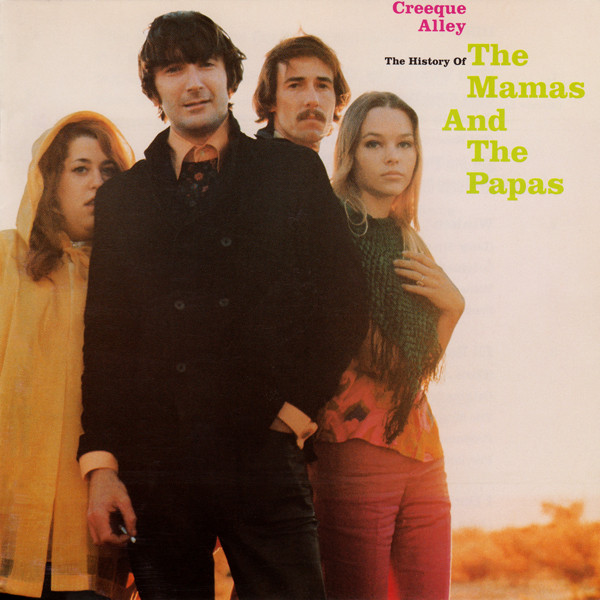

# Creeque Alley - The History Of The Mamas And The Papas

By The Mamas & the Papas

## Album Data

- Catalog #: Roon
- Format: Digital, Album

## Track listing

1-1 Wild Women
1-2 Winken', Blinken and Nod
1-3 I'll Remember Tonight
1-4 I Don't Wanna Know
1-5 This Precious Time [Single Version]
1-6 John Phillips Dialog from "A Gathering of Flowers: The Anthology of the Mamas and the Papas"
1-7 California Dreamin'
1-8 Go Where You Wanna Go
1-9 Monday, Monday
1-10 You Baby
1-11 Do You Wanna Dance
1-12 I Call Your Name
1-13 Spanish Harlem
1-14 Straight Shooter
1-15 Got a Feelin'
1-16 I Saw Her Again
1-17 Look Through My Window [Single Version]
1-18 Words of Love
1-19 Dancing in the Street
1-20 Mama Cass Dialog from "A Gathering of Flowers: The Anthology of the Mamas and the Papas"
1-21 Once Was a Time I Thought
1-22 No Salt On Her Tail
2-1 Trip, Stumble & Fall
2-2 Dancing Bear
2-3 Dedicated to the One I Love [Single Version]
2-4 Creeque Alley
2-5 My Girl
2-6 Twist and Shout
2-7 I Call Your Name [Live (Edit)]
2-8 Twelve-Thirty (Young Girls Are Coming to the Canyon)
2-9 Glad to Be Unhappy
2-10 For the Love of Ivy
2-11 Safe in My Garden
2-12 Midnight Voyage
2-13 Dream a Little Dream of Me
2-14 California Earthquake
2-15 It's Getting Better
2-16 Make Your Own Kind of Music
2-17 Mississippi
2-18 Whatcha Gonna Do [Single Version]
2-19 Mama Cass Dialog from "A Gathering of Flowers: The Anthology of the Mamas and the Papas"
2-20 Step Out
2-21 The Aching Kind

