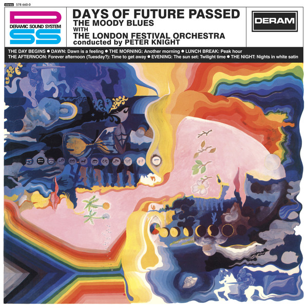

# Days Of Future Passed (Deluxe Version)

By The Moody Blues

## Album Data

- Catalog #: Roon
- Format: Digital, Album

## Track listing

1-1 The Day Begins [Incl. Morning Glory]
1-2 Dawn: Dawn Is a Feeling (original 1967 stereo mix)
1-3 The Morning: Another Morning (original 1967 stereo mix)
1-4 Lunch Break: Peak Hour (original 1967 stereo mix)
1-5 The Afternoon: Forever Afternoon (Tuesday?)/Time to Get Away
1-6 Evening: The Sun Set/Twilight Time
1-7 The Night: Nights in White Satin (original 1967 stereo mix)
1-8 Long Summer Days
1-9 Please Think About It
1-10 Don't Let Me Be Misunderstood [BBC "Saturday Club"Session]
1-11 Love and Beauty (BBC "Easybeat" session)
1-12 Leave This Man Alone (BBC "Easybeat" session)
1-13 Peak Hour (BBC "Easybeat" session)
1-14 Nights in White Satin (BBC "Dave Symonds" session)
1-15 Fly Me High (BBC "Dave Symonds" session)
1-16 Twilight Time [BBC "Dave Symonds"Session]
2-1 The Day Begins (1972 stereo mix)
2-2 Dawn: Dawn Is a Feeling (1972 stereo mix)
2-3 The Morning: Another Morning (1972 stereo mix)
2-4 Lunch Break: Peak Hour (1972 stereo mix)
2-5 The Afternoon: Forever Afternoon (Tuesday?)/Time to Get Away
2-6 Evening: The Sun Set: Twilight Time
2-7 The Night: Nights in White Satin (1972 stereo mix)
2-8 Tuesday Afternoon [Alternative Mix]
2-9 Dawn: Dawn Is a Feeling [Alternative Version]
2-10 The Sun Set [Alternative Version Without Orchestra]
2-11 Twilight Time [Alternative Vocal Mix]
2-12 Fly Me High (A-side of single)
2-13 I Really Haven't Got the Time (B-side of single)
2-14 Love and Beauty (A-side of single)
2-15 Leave This Man Alone
2-16 Nights in White Satin (A-side of single)
2-17 Cities (B-side of single)

