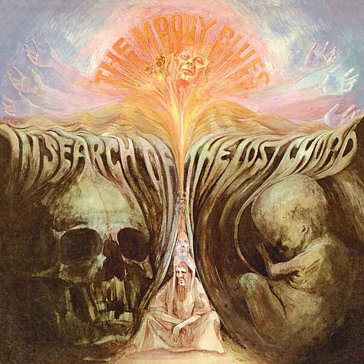

# In Search Of The Lost Chord (50th Anniversary Deluxe Edition) (50th Anniversary Edition / Deluxe)

By The Moody Blues

## Album Data

- Catalog #: Roon
- Format: Digital, Album

## Track listing

1-1 Departure
1-2 Ride My See-Saw
1-3 Dr. Livingstone, I Presume
1-4 House of Four Doors
1-5 Legend of a Mind
1-6 House of Four Doors, Pt. 2
1-7 Voices in the Sky
1-8 The Best Way to Travel
1-9 Visions of Paradise
1-10 The Actor
1-11 The Word
1-12 Om
1-13 Voices in the Sky [Mono]
1-14 Dr. Livingstone, I Presume [Mono]
1-15 Ride My See Saw [Mono]
1-16 A Simple Game (1968 single)
1-17 Legend of a Mind [Mono Mix]
2-1 Departure
2-2 Ride My See-Saw
2-3 Dr. Livingstone, I Presume
2-4 House of Four Doors
2-5 Legend of a Mind
2-6 House of Four Doors, Pt. 2
2-7 Voices in the Sky
2-8 The Best Way to Travel
2-9 Visions of Paradise
2-10 The Actor
2-11 The Word
2-12 Om
2-13 A Simple Game [Justin Hayward Vocal Mix]
3-1 Dr. Livingstone, I Presume [BBC Radio One "Top Gear" Session 1968]
3-2 Voices in the Sky [BBC Radio One "Top Gear" Session 1968]
3-3 The Best Way to Travel [BBC Radio One "Top Gear" Session]
3-4 Ride My See-Saw [BBC Radio One "Top Gear" Session 1968]
3-5 Tuesday Afternoon [BBC Radio One John Peel "Top Gear" Session, July 16, 1968]
3-6 Departure [Alternate Mix]
3-7 The Best way to Travel [Additional Vocal Mix]
3-8 Legend of a Mind [Alternate Mix]
3-9 Visions of Paradise [Instrumental Mix]
3-10 The Word [Mellotron Mix]
3-11 Om [Extended Mix]
3-12 King and Queen (recorded 2/13/68)
3-13 Gimmie a Little Something
3-14 What Am I Doing Here? [Full Version]
3-15 A Simple Game [Justin Hayward Vocal Version]

