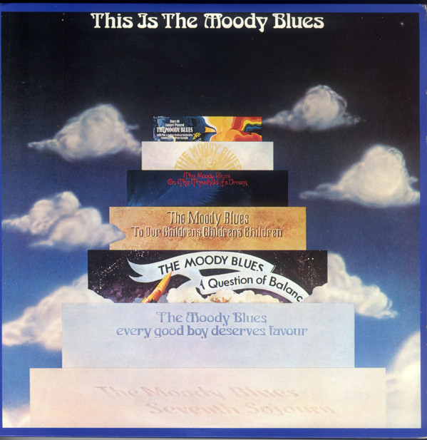

# This Is The Moody Blues

By The Moody Blues

## Album Data

- Catalog #: Roon
- Format: Digital, Album

## Track listing

1-1 Question
1-2 The Actor
1-3 The Word (poem)
1-4 Eyes of a Child
1-5 Dear Diary
1-6 Legend of a Mind
1-7 In the Beginning
1-8 Lovely to See You
1-9 Never Comes the Day
1-10 Isn't Life Strange
1-11 The Dream (poem)
1-12 Have You Heard?, Pt. 1
1-13 The Voyage
1-14 Have You Heard?, Pt. 2
2-1 Ride My See Saw
2-2 Tuesday Afternoon (Forever Afternoon)
2-3 And the Tide Rushes In
2-4 New Horizons
2-5 A Simple Game
2-6 Watching and Waiting
2-7 I'm Just a Singer (in a Rock and Roll Band)
2-8 For My Lady
2-9 The Story in Your Eyes
2-10 Melancholy Man [Full Version]
2-11 Nights in White Satin [Full Version]
2-12 Late Lament

