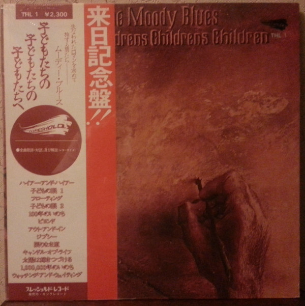

# To Our Children's Children's Children

By The Moody Blues

## Album Data

- Catalog #: Roon
- Format: Digital, Album

## Track listing

1. Higher and Higher
2. Eyes of a Child, Pt. 1
3. Floating
4. Eyes of a Child, Pt. 2
5. I Never Thought I'd Live to Be a Hundred
6. Beyond
7. Out and In
8. Gypsy (Of a Strange and Distant Time)
9. Eternity Road
10. Candle of Life
11. Sun Is Still Shining
12. I Never Thought I'd Live to Be a Million
13. Watching and Waiting
14. Gypsy [Alternate Version]
15. Candle of Life [Alternate Version]
16. Sun is Still Shining [Extended Version]
17. Have You Heard/the Voyage/Have You Heard [Bbc Radio Session]
18. Legend of a Mind [Bbc Radio Session]

