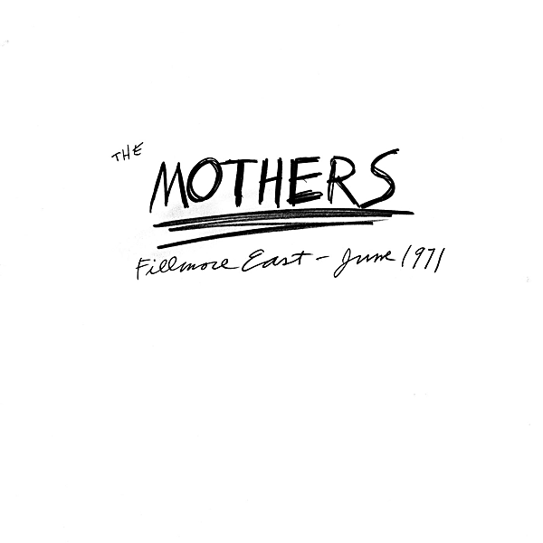

# Fillmore East - June 1971

By The Mothers of Invention

## Album Data

- Catalog #: Roon
- Format: Digital, Album

## Track listing

1. Little House I Used To Dream In
2. The Mud Shark
3. What Kind of Girl Do You Think We We Are?
4. Bwana Dik
5. Latex Solar Beef
6. Willie the Pimp, Pt. 1
7. Willie the Pimp, Pt. 2
8. Do You Like My New Car?
9. Happy Together
10. Lonesome Electric Turkey
11. Peaches En Regalia
12. Tears Began To Fall

