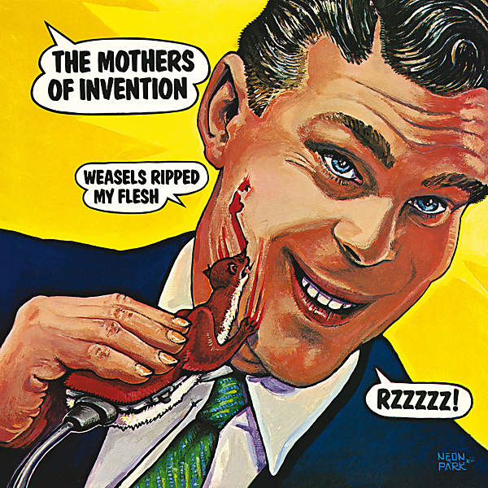

# Weasels Ripped My Flesh

By The Mothers of Invention

## Album Data

- Catalog #: Roon
- Format: Digital, Album

## Track listing

1. Didja Get Any Onya?
2. Directly from My Heart to You
3. Prelude to the Afternoon of a Sexually Aroused Gas Mask
4. Toads of the Short Forest
5. Get a Little
6. The Eric Dolphy Memorial Barbecue
7. Dwarf Nebula Processional March & Dwarf Nebula
8. My Guitar Wants to Kill Your Mama
9. Oh No
10. The Orange County Lumber Truck
11. Weasels Ripped My Flesh

## See also

- [Absolutely Free](Absolutely_Free.md)
- [Bongo Fury (Live)](Bongo_Fury_Live.md)
- [Fillmore East - June 1971](Fillmore_East_-_June_1971.md)
- [Just Another Band From L.A. (Live)](Just_Another_Band_From_LA_Live.md)
- [One Size Fits All](One_Size_Fits_All.md)
- [Over-Nite Sensation](Over-Nite_Sensation.md)
- [We're Only In It For The Money](Were_Only_In_It_For_The_Money.md)
