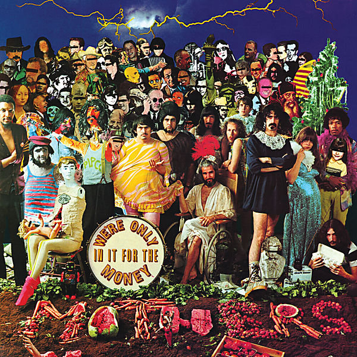

# We're Only In It For The Money

By The Mothers of Invention

## Album Data

- Catalog #: Roon
- Format: Digital, Album

## Track listing

1. Are You Hung Up?
2. Who Needs the Peace Corps?
3. Concentration Moon
4. Mom & Dad
5. Telephone Conversation
6. Bow Tie Daddy
7. Harry, You're a Beast
8. What's the Ugliest Part of Your Body?
9. Absolutely Free
10. Flower Punk
11. Hot Poop
12. Nasal Retentive Calliope Music
13. Let's Make the Water Turn Black
14. The Idiot Bastard Son
15. Lonely Little Girl
16. Take Your Clothes Off When You Dance
17. What's the Ugliest Part of Your Body? (reprise)
18. Mother People
19. The Chrome Plated Megaphone of Destiny

## See also

- [Absolutely Free](Absolutely_Free.md)
- [Bongo Fury (Live)](Bongo_Fury_Live.md)
- [Fillmore East - June 1971](Fillmore_East_-_June_1971.md)
- [Just Another Band From L.A. (Live)](Just_Another_Band_From_LA_Live.md)
- [One Size Fits All](One_Size_Fits_All.md)
- [Over-Nite Sensation](Over-Nite_Sensation.md)
- [Weasels Ripped My Flesh](Weasels_Ripped_My_Flesh.md)
