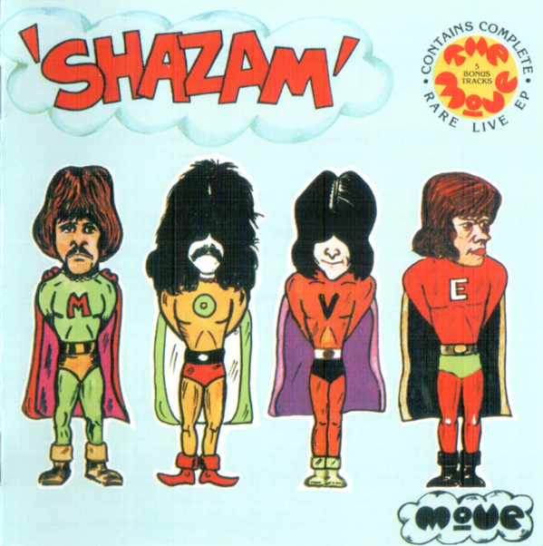

# Shazam

By The Move

## Album Data

- Catalog #: Roon
- Format: Digital, Album

## Track listing

1. Hello Susie
2. Beautiful Daughter
3. Cherry Blossom Clinic Revisited
4. Fields of People
5. Don't Make My Baby Blue
6. The Last Thing on My Mind
7. This Time Tomorrow
8. A Certain Something
9. Curly (alternate mix)
10. Wild Tiger Woman (stereo mix)
11. Omnibus (full-length version)
12. That Certain Something (demo version)
13. This Time Tomorrow (demo version)
14. Blackberry Way (alternate mix)

## See also

- [Beets: Fire Brigade](../../Beets/The_Move/Fire_Brigade.md)
- [Beets: Live at the Fillmore 1969](../../Beets/The_Move/Live_at_the_Fillmore_1969.md)
- [Beets: Looking On](../../Beets/The_Move/Looking_On.md)
- [Beets: Message From the Country](../../Beets/The_Move/Message_From_the_Country.md)
- [Vinyl: Fire Brigade](../../Vinyl/The_Move/Fire_Brigade.md)
- [Vinyl: Looking On](../../Vinyl/The_Move/Looking_On.md)
- [Vinyl: ](../../Vinyl/The_Move/The_Move.md)
