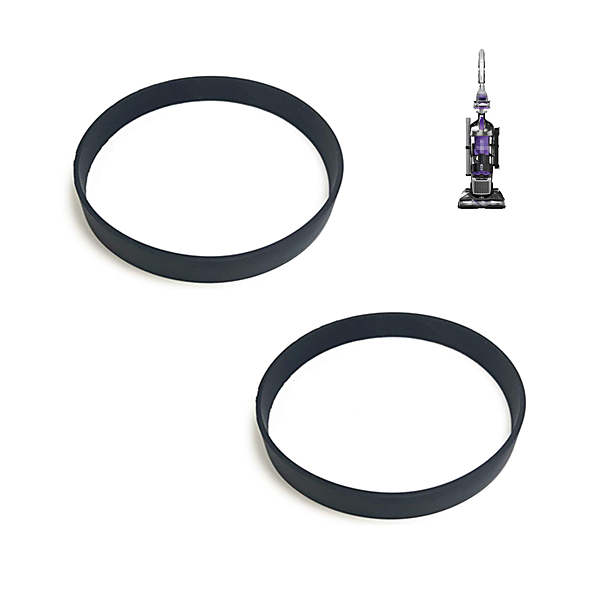

# Will The Circle Be Unbroken (40th Anniversary Edition)

By The Nitty Gritty Dirt Band

## Album Data

- Catalog #: Roon
- Format: Digital, Album

## Track listing

1. Grand Ole Opry Song
2. Keep on the Sunny Side
3. Nashville Blues
4. You Are My Flower
5. The Precious Jewel
6. Dark as a Dungeon
7. Tennessee Stud
8. Black Mountain Rag
9. Wreck on the Highway
10. The End of the World
11. I Saw the Light
12. Sunny Side of the Mountain
13. Nine Pound Hammer
14. Losin' You (Might Be the Best Thing Yet)
15. Honky Tonkin'
16. You Don't Know My Mind
17. My Walkin' Shoes
18. Lonesome Fiddle Blues
19. Cannonball Rag
20. Avalanche
21. Flint Hill Special
22. Togary Mountain
23. Earl's Breakdown
24. Orange Blossom Special
25. Wabash Cannonball
26. Lost Highway
27. Doc Watson and Merle Travis: First Meeting (dialogue)
28. Way Downtown
29. Down Yonder
30. Pins and Needles (in My Heart)
31. Honky Tonk Blues
32. Sailin' On to Hawaii
33. I'm Thinking Tonight of My Blue Eyes
34. I Am a Pilgrim
35. Wildwood Flower
36. Soldier's Joy
37. Will the Circle Be Unbroken
38. Both Sides Now

