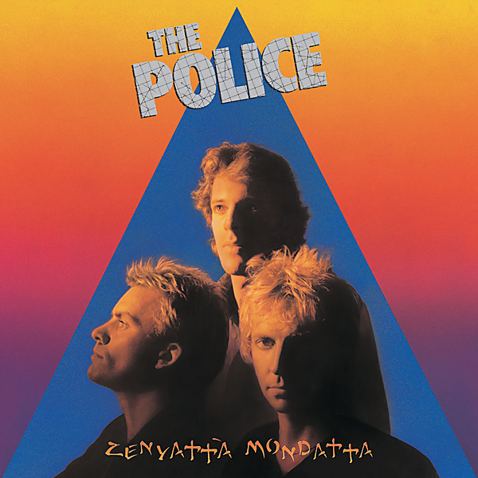

# Zenyatta Mondatta (Remastered 2003)

By The Police

## Album Data

- Catalog #: Roon
- Format: Digital, Album

## Track listing

1. Don't Stand So Close to Me
2. Driven to Tears
3. When the World Is Running Down, You Make the Best of What's Still ...
4. Canary in a Coalmine
5. Voices Inside My Head
6. Bombs Away
7. De Do Do Do, De Da Da Da
8. Behind My Camel
9. Man in a Suitcase
10. Shadows in the Rain
11. The Other Way of Stopping

## See also

- [Ghost In The Machine (Remastered 2003)](Ghost_In_The_Machine_Remastered_2003.md)
- [Synchronicity (Remastered 2003)](Synchronicity_Remastered_2003.md)
- [Vinyl: "De Do Do Do, De Da Da Da (In Japanese)"](../../Vinyl/The_Police/De_Do_Do_Do__De_Da_Da_Da_In_Japanese.md)
- [Vinyl: ](../../Vinyl/The_Police/The_Police.md)
