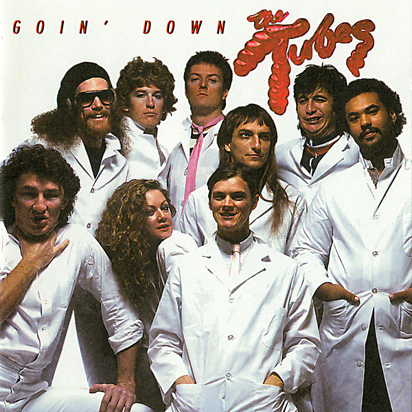

# Goin' Down

By The Tubes

## Album Data

- Catalog #: Roon
- Format: Digital, Album

## Track listing

1-1 White Punks on Dope, Pts. A-B B
1-2 Up from the Deep
1-3 Malagueña Salerosa
1-4 What Do You Want from Life?
1-5 Boy Crazy
1-6 Tubes World Tour
1-7 Don't Touch Me There
1-8 Slipped My Disco
1-9 Smoke (La Vie En Fumer)
1-10 My Head Is My Only House Unless It Rains
1-11 God-Bird-Change
1-12 I'm Just a Mess
1-13 This Town
1-14 Pound of Flesh
1-15 Drivin' All Night
1-16 Love Will Keep Us Together
1-17 White Punks on Dope
2-1 Turn Me On
2-2 TV Is King
2-3 Prime Time
2-4 I Want It All Now
2-5 No Way Out
2-6 Getoverture
2-7 No Mercy
2-8 Only the Strong Survive
2-9 Be Mine Tonight
2-10 Love's a Mystery (I Don't Understand)
2-11 Telecide
2-12 Overture
2-13 Mondo Bondage
2-14 Crime Medley: (Siren) Theme from Dragnet/Theme from Peter Gunn/Theme from Perry Mason/Theme from The Untouchables
2-15 I Was a Punk Before You Were a Punk
2-16 I Saw Her Standing There
2-17 White Punks on Dope

