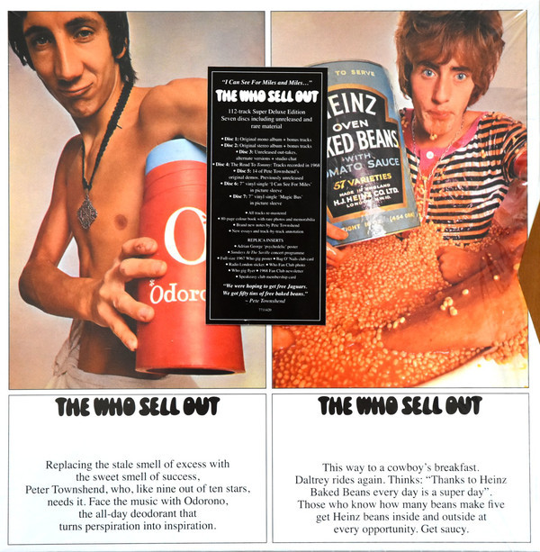

# The Who Sell Out (Super Deluxe)

By The Who

## Album Data

- Catalog #: Roon
- Format: Digital, Album

## Track listing

1-1 Armenia City In the Sky [Incl. Two Radio London Jingles]
1-2 Heinz Baked Beans [Incl. More Music Jingle]
1-3 Mary Anne With the Shaky Hand [Acoustic/Incl. Premier Drums Commercial/Radio London Jingle]
1-4 Odorono [Incl. Radio London 'Smooth Sailing' Jingle]
1-5 Tattoo [Incl. Church of Your Choice Jingle]
1-6 Our Love Was [Incl. Pussycat/Speakeasy/Rotosound Jingles,Commercials]
1-7 I Can See For Miles
1-8 I Can't Reach You [Incl. Charles Atlas Commercial]
1-9 Medac
1-10 Relax
1-11 Silas Stingy
1-12 Sunrise
1-13 Real [1 & 2]
1-14 Pictures of Lily (single mix / mono version)
1-15 Doctor, Doctor (single mix / mono version)
1-16 The Last Time (UK single mix / mono version)
1-17 Under My Thumb (UK single mix / mono version)
1-18 I Can See for Miles (US single mix / mono version)
1-19 Mary Anne With the Shaky Hand (US single mix / mono version)
1-20 Someone's Coming (US single mix / mono version)
1-21 Early Morning Cold Taxi (incl. "Radio London News Bulletin" jingle / 1967 mono version)
1-22 Jaguar (incl. "Radio London News Bulletin" jingle / 1967 mono version)
1-23 Tattoo (early alternate mix / mono version)
1-24 Rael (Pt. 1 & Pt. 2 / early Talentmasters mix / mono version)
1-25 Our Love Was (take 12 rejected mono mix)
1-26 I Can See for Miles (early mono version)
1-27 Someone's Coming (UK single mix / mono version)
1-28 Magic Bus (US / UK mono version)
1-29 Dr. Jekyll & Mr. Hyde (US single mix / mono version)
2-1 Armenia City in the Sky (incl. two Radio London jingles)
2-2 Heinz Baked Beans (incl. "More Music" jingle)
2-3 Mary Anne With the Shaky Hand (acoustic / incl. "Premier Drums Commercial" / Radio London jingle)
2-4 Odorono (incl. Radio London "Smooth Sailing" jingle)
2-5 Tattoo (incl. "Church of Your Choice" jingle)
2-6 Our Love Was (incl. "Pussycat, Speakeasy & Rotosound" jingles)
2-7 I Can See for Miles
2-8 I Can't Reach You (incl. "Charles Atlas" commercial)
2-9 Medac
2-10 Relax
2-11 Silas Stingy
2-12 Sunrise
2-13 Rael (Pt. 1 & Pt. 2)
2-14 Rael Naïve (full coda)
2-15 Mary Anne With the Shaky Hand
2-16 Summertime Blues (stereo version / 2014 HD version)
2-17 Early Morning Cold Taxi
2-18 Girl's Eyes
2-19 Coke After Coke (stereo version / 2014 HD version)
2-20 Things Go Better With Coke (stereo version / 2014 HD version)
2-21 In the Hall of the Mountain King (stereo version / 2014 HD version)
2-22 Jaguar
2-23 Rael (Pt. 1 & Pt. 2 / IBC remake)
3-1 Glittering Girl (take 4 / 2018 mix)
3-2 Girl's Eyes (take 2 / 2018 mix)
3-3 The Last Time (take 8 / 2018 mix)
3-4 Under My Thumb (take 3 / 2018 mix)
3-5 Our Love Was (take 2)
3-6 Relax (4‐track to 4‐track mix / 2018 mix)
3-7 Relax (take 1 & 2 / 2018 mix)
3-8 Mary Anne With the Shaky Hand (take 1 & 9 / 2018 mix)
3-9 Relax (remake take 4)
3-10 I Can See for Miles (full version)
3-11 Medac (take 11)
3-12 Odorono (take 3 / Full version / 2018 mix)
3-13 Heinz Baked Beans (take 1 & 3 / 2018 mix)
3-14 Top Gear (take 1, 2 & 5 / 2018 mix)
3-15 Premier Drums (take 1 & 4 / 2018 mix)
3-16 Charles Atlas (take 1)
3-17 Rotosound Strings (take 1 / 2018 mix)
3-18 Track Records (2018 mix)
3-19 John Mason Cars / Speakeasy / Rotosound Strings / Bag o' Nails (2018 mix)
3-20 It's a Girl (aka ‘Glow Girl', take 2, 3 & 4)
3-21 Mr. Hyde (aka ‘Dr. Jekyll and Mr Hyde', take 7 / first stage master / 2018 mix)
3-22 Little Billy (aka ‘Little Billy's Doing Fine', take 1 & 3)
3-23 Mrs. Walker (aka ‘Glow Girl', take 7 / 4‐track to 4‐track mix)
3-24 Lightning (aka ‘Call Me Lightning', take 1 & 8)
3-25 Dogs (take 2)
3-26 Melancholia (take 1)
3-27 Magic Bus (take 6)
4-1 Glow Girl (2018 mix)
4-2 Faith in Something Bigger (2018 mix)
4-3 Dr.Jekyll & Mr. Hyde (2018 mix)
4-4 Call Me Lightning (2018 mix)
4-5 Little Billy's Doing Fine (2018 mix)
4-6 Dogs (2018 mix)
4-7 Melancholia (2018 mix)
4-8 Fortune Teller (2018 mix)
4-9 Facts of Life (aka Birds and Bees, backing track / 2018 mix)
4-10 Call Me Lightning (single mix / mono version)
4-11 Dr Jekyll & Mr Hyde (UK single mix / mono version)
4-12 Dogs (single mix / mono version)
4-13 Magic Bus (long version / mono version)
5-1 Kids? Do You Want Kids
5-2 Relax (demo mix)
5-3 Glow Girl (demo mix)
5-4 Glow Girl [Version 2]
5-5 Inside Outside USA
5-6 Jaguar (demo mix)
5-7 Little Billy (demo mix)
5-8 Odorono (demo mix)
5-9 Pictures of Lily (demo mix, new 2018 mix)
5-10 Relax (demo mix)
5-11 Melancholia (demo mix, new 2018 mix)
5-12 Thinking of You All the While [Sunrise]
5-13 Mary Anne With the Shaky Hand (demo mix)

