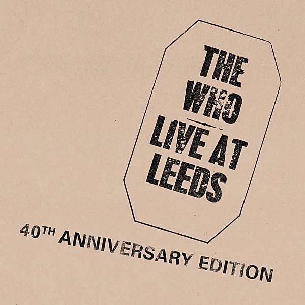

# Tommy (Super Deluxe)

By The Who

## Album Data

- Catalog #: Roon
- Format: Digital, Album

## Track listing

1. Overture
2. It's a Boy
3. 1921 (You Didn't Hear It)
4. Amazing Journey
5. Sparks
6. Eyesight To The Blind [The Hawker]
7. Christmas
8. Cousin Kevin
9. The Acid Queen
10. Underture
11. Do You Think It's Alright?
12. Fiddle About
13. Pinball Wizard
14. There's a Doctor [Original Album Vertsion]
15. Go To the Mirror!
16. Tommy Can You Hear Me?
17. Smash the Mirror
18. Sensation
19. Miracle Cure
20. Sally Simpson
21. I'm Free [Studio Version]
22. Welcome
23. Tommy's Holiday Camp
24. We're Not Gonna Take It
25. Overture (Including Introduction) (live in Canada / 1969)
26. It's a Boy (live in Canada / 1969)
27. 1921 (live in Canada / 1969)
28. Amazing Journey (live in Canada / 1969)
29. Sparks (live in Canada / 1969)
30. The Hawker (Eyesight to the Blind) (live in Canada / 1969)
31. Christmas (live in Canada / 1969)
32. The Acid Queen (live in Canada / 1969)
33. Pinball Wizard (live in Canada / 1969)
34. Do You Think It's Alright? (live in Canada / 1969)
35. Fiddle About (live in Canada / 1969)
36. Tommy, Can You Hear Me? (live in Canada / 1969)
37. There's a Doctor (live in Canada / 1969)
38. Go to the Mirror! (live in Canada / 1969)
39. Smash the Mirror (live in Canada / 1969)
40. Miracle Cure (live in Canada / 1969)
41. Sally Simpson (live in Canada / 1969)
42. I'm Free (live in Canada / 1969)
43. Tommy's Holiday Camp (live in Canada / 1969)
44. We're Not Gonna Take It (live in Canada / 1969)
45. See Me, Feel Me / Listening to You (live in Canada / 1969)
46. Overture (demo)
47. It's a Boy (demo)
48. 1921 (demo)
49. Amazing Journey (demo)
50. Dream One (demo)
51. Sparks (demo)
52. The Hawker (Eyesight to the Blind) (demo)
53. Christmas (demo)
54. The Acid Queen (demo)
55. Underture (Dream Two) (demo)
56. Do You Think It's Alright? (demo)
57. Pinball Wizard (demo)
58. There's a Doctor (demo)
59. Go to the Mirror! (demo)
60. Success (demo)
61. Tommy, Can You Hear Me? (demo)
62. Smash the Mirror (demo)
63. Sensation (demo)
64. Miracle Cure (demo)
65. Sally Simpson (demo)
66. I'm Free (demo)
67. Welcome (demo)
68. We're Not Gonna Take It (demo)
69. Trying to Get Through
70. Young Man Blues

## See also

- [A Quick One (Stereo Version)](A_Quick_One_Stereo_Version.md)
- [Face Dances](Face_Dances.md)
- [Live At Leeds (Live At Leeds/1970)](Live_At_Leeds_Live_At_Leeds-1970.md)
- [My Generation (Stereo Version)](My_Generation_Stereo_Version.md)
- [Quadrophenia (Super Deluxe)](Quadrophenia_Super_Deluxe.md)
- [The Who Sell Out (Super Deluxe)](The_Who_Sell_Out_Super_Deluxe.md)
- [Who's Next (Deluxe Edition)](Whos_Next_Deluxe_Edition.md)
- [Beets: A Quick One](../../Beets/The_Who/A_Quick_One.md)
- [Beets: Face Dances](../../Beets/The_Who/Face_Dances.md)
- [Beets: Live at Leeds](../../Beets/The_Who/Live_at_Leeds.md)
- [Beets: My Generation](../../Beets/The_Who/My_Generation.md)
- [Beets: Odds & Sods](../../Beets/The_Who/Odds_and_Sods.md)
- [Beets: The Who Sell Out](../../Beets/The_Who/The_Who_Sell_Out.md)
- [Beets: Tommy](../../Beets/The_Who/Tommy.md)
- [Beets: Who’s Next](../../Beets/The_Who/Who’s_Next.md)
- [Beets: Who's Next](../../Beets/The_Who/Whos_Next.md)
- [CD: ](../../CD/The_Who/The_Who.md)
- [CD: Tommy](../../CD/The_Who/Tommy.md)
- [Vinyl: A Quick One](../../Vinyl/The_Who/A_Quick_One.md)
- [Vinyl: My Generation](../../Vinyl/The_Who/My_Generation.md)
- [Vinyl: Squeeze Box](../../Vinyl/The_Who/Squeeze_Box.md)
- [Vinyl: ](../../Vinyl/The_Who/The_Who.md)
- [Vinyl: The Who Sell Out](../../Vinyl/The_Who/The_Who_Sell_Out.md)
- [Vinyl: Tommy](../../Vinyl/The_Who/Tommy.md)
- [Vinyl: Who Are You](../../Vinyl/The_Who/Who_Are_You.md)
- [Vinyl: Who's Missing](../../Vinyl/The_Who/Whos_Missing.md)
- [Vinyl: Who's Next](../../Vinyl/The_Who/Whos_Next.md)
