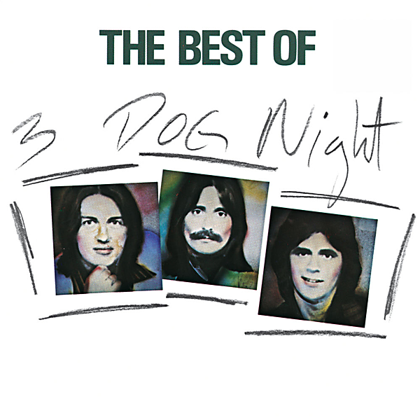

# The Best Of 3 Dog Night

By Three Dog Night

## Album Data

- Catalog #: Roon
- Format: Digital, Album

## Track listing

1. Joy to the World
2. Easy to Be Hard
3. Family of Man
4. Sure as I'm Sittin' Here
5. An Old Fashioned Love Song
6. Mama Told Me (Not to Come)
7. Try a Little Tenderness
8. Shambala
9. Let Me Serenade You
10. Never Been to Spain
11. Black and White
12. Pieces of April
13. Liar
14. Out in the Country
15. The Show Must Go On
16. Eli's Coming
17. One Man Band
18. One
19. Play Something Sweet (Brickyard Blues)
20. Celebrate

## See also

- [It Ain't Easy](It_Aint_Easy.md)
- [Naturally](Naturally.md)
- [Suitable For Framing](Suitable_For_Framing.md)
- [Three Dog Night](Three_Dog_Night.md)
- [Beets: The Best of Three Dog Night](../../Beets/Three_Dog_Night/The_Best_of_Three_Dog_Night.md)
- [Vinyl: Mama Told Me (Not To Come)](../../Vinyl/Three_Dog_Night/Mama_Told_Me_Not_To_Come.md)
- [Vinyl: ](../../Vinyl/Three_Dog_Night/Three_Dog_Night.md)
