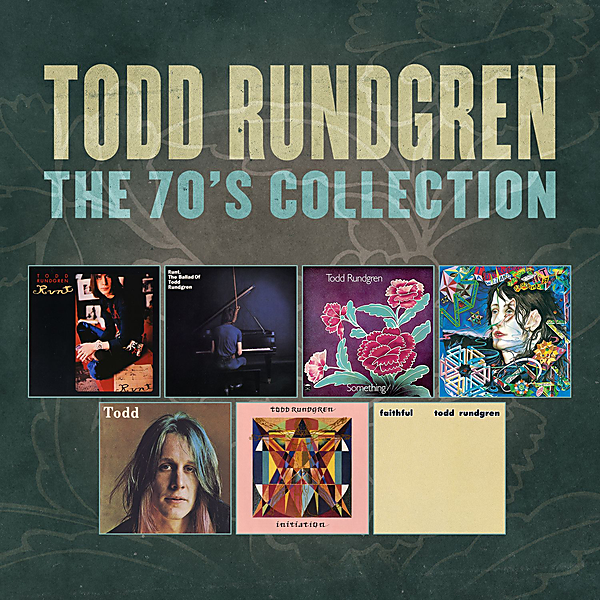

# The 70's Collection

By Todd Rundgren

## Album Data

- Catalog #: Roon
- Format: Digital, Album

## Track listing

1-1 Broke Down and Busted
1-2 Believe in Me
1-3 We Gotta Get You a Woman
1-4 Who's That Man?
1-5 Once Burned
1-6 Devil's Bite
1-7 I'm in the Clique
1-8 There Are No Words
1-9 Baby Let's Swing / The Last Thing You Said / Don't Tie My Hands
1-10 Birthday Carol
2-1 Long Flowing Robe
2-2 The Ballad (Denny & Jean)
2-3 Bleeding
2-4 Wailing Wall
2-5 The Range War
2-6 Chain Letter
2-7 A Long Time, a Long Way to Go
2-8 Boat on the Charles
2-9 Be Nice to Me
2-10 Hope I'm Around
2-11 Parole
2-12 Remember Me
3-1 I Saw the Light
3-2 It Wouldn't Have Made Any Difference
3-3 Wolfman Jack
3-4 Cold Morning Light
3-5 It Takes Two to Tango (This Is for the Girls)
3-6 Sweeter Memories
3-7 Intro
3-8 Breathless (Instrumental)
3-9 The Night the Carousel Burned Down
3-10 Saving Grace
3-11 Marlene
3-12 Song of the Viking
3-13 I Went to the Mirror
3-14 Black Maria
3-15 One More Day (No Word)
3-16 Couldn't I Just Tell You
3-17 Torch Song
3-18 Little Red Lights
3-19 Overture - My Roots: Money (That's What I Want) / Messin' with the Kid
3-20 Dust in the Wind
3-21 Piss Aaron
3-22 Hello It's Me
3-23 Some Folks Is Even Whiter Than Me
3-24 You Left Me Sore
3-25 Slut
4-1 International Feel
4-2 Never Never Land
4-3 Tic Tic Tic, It Wears Off
4-4 You Need Your Head
4-5 Rock & Roll Pussy
4-6 Dogfight Giggle
4-7 You Don't Have to Camp Around
4-8 Flamingo
4-9 Zen Archer
4-10 Just Another Onionhead / Da Da Dali
4-11 When the Shit Hits the Fan / Sunset Blvd.
4-12 Le Feel Internacionale
4-13 Sometimes I Don't Know What to Feel
4-14 Does Anybody Love You?
4-15 Medley: I'm so Proud / Ooh Baby Baby / La La Means I Love You / Cool Jerk
4-16 Hungry for Love
4-17 I Don't Want to Tie You Down
4-18 Is It My Name?
4-19 Just One Victory
5-1 How About a Little Fanfare?
5-2 I Think You Know
5-3 The Spark of Life
5-4 An Elpee's Worth of Toons
5-5 A Dream Goes on Forever
5-6 Lord Chancellor's Nightmare Song
5-7 Drunken Blue Rooster
5-8 The Last Ride
5-9 Everybody's Going to Heaven / King Kong Reggae
5-10 No. 1 Lowest Common Denominator
5-11 Useless Begging
5-12 Sidewalk Cafe
5-13 Izzat Love?
5-14 Heavy Metal Kids
5-15 In and Out the Chakras We Go (Formerly Shaft Goes to Outer Space)
5-16 Don't You Ever Learn?
5-17 Sons of 1984
6-1 Real Man
6-2 Born to Synthesize
6-3 The Death of Rock 'N' Roll
6-4 Eastern Intrigue
6-5 Initiation
6-6 Fair Warning
6-7 A Treatise on Cosmic Fire (Intro-Prana)
6-8 A Treatise on Cosmic Fire (II. The Fire of Mind - or Solar Fire)
6-9 A Treatise on Cosmic Fire (III. The Fire of Spirit - or Electric Fire)
6-10 A Treatise on Cosmic Fire (I. The Eternal Fire - or Fire by Friction) [Outro-Prana]
7-1 Happenings Ten Years Time Ago
7-2 Good Vibrations
7-3 Rain
7-4 Most Likely You Go Your Way (And I'll Go Mine)
7-5 If 6 Was 9
7-6 Strawberry Fields Forever
7-7 Black and White
7-8 Love of the Common Man
7-9 When I Pray
7-10 Cliché
7-11 The Verb "To Love"
7-12 Boogies (Hamburger Hell)
8-1 All the Children Sing
8-2 Can We Still Be Friends?
8-3 Hurting for You
8-4 Too Far Gone
8-5 Onomatopoeia
8-6 Determination
8-7 Bread
8-8 Bag Lady
8-9 You Cried Wolf
8-10 Lucky Guy
8-11 Out of Control
8-12 Fade Away

