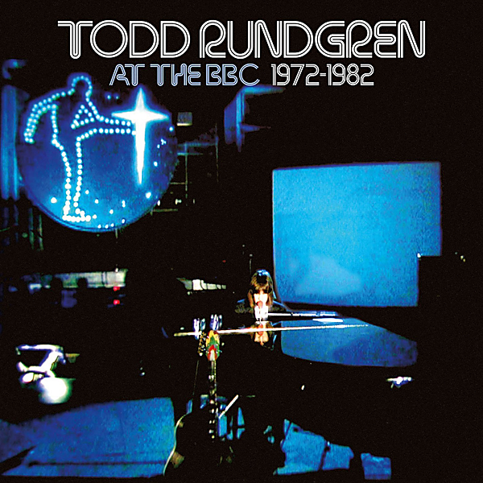

# Todd Rundgren at the BBC: 1972-1982

By Todd Rundgren

## Album Data

- Catalog #: Roon
- Format: Digital, Album

## Track listing

1-1 I Saw the Light
1-2 It Wouldn't Have Made Any Difference
1-3 Piss Aaron
1-4 Hello It's Me
1-5 Be Nice to Me
1-6 Black Maria
1-7 Real Man
1-8 The Seven Rays
2-1 Freedom Fighters
2-2 Mister Triscuits
2-3 Something's Coming
2-4 The Last Ride
2-5 Sunset Boulevard/Le Feel Internacionale
2-6 Heavy Metal Kids
2-7 The Wheel
2-8 Open My Eyes
2-9 Sons of 1984
2-10 Do Ya
2-11 Couldn't I Just Tell You
3-1 Overture: Mountain Top and Sunrise/Communion with the Sun
3-2 Love of the Common Man
3-3 Sunburst Finish
3-4 Jealousy
3-5 Windows
3-6 Singring and the Glass Guitar
3-7 Utopia Theme

