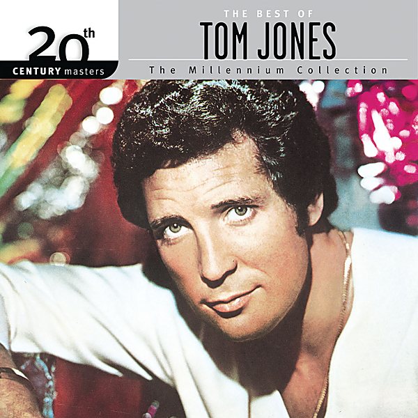

# The Best Of Tom Jones - 20th Century Masters: The Millennium Collection

By Tom Jones

## Album Data

- Catalog #: Roon
- Format: Digital, Album

## Track listing

1. It's Not Unusual
2. What's New Pussycat? (From the Film What's New Pussycat?)
3. Thunderball (From the Film Thunderball)
4. Detroit City
5. Green, Green Grass of Home
6. (It Looks Like) I'll Never Fall in Love Again
7. Delilah
8. Love Me Tonight
9. Without Love (There Is Nothing)
10. Daughter of Darkness
11. She's a Lady
12. I (Who Have Nothing)

## See also

- [Live In Las Vegas (Live)](Live_In_Las_Vegas_Live.md)
- [Reload](Reload.md)
- [Surrounded By Time](Surrounded_By_Time.md)
- [The Lead And How To Swing It](The_Lead_And_How_To_Swing_It.md)
- [Vinyl: ](../../Vinyl/Tom_Jones/Tom_Jones.md)
- [Vinyl: What A Night](../../Vinyl/Tom_Jones/What_A_Night.md)
