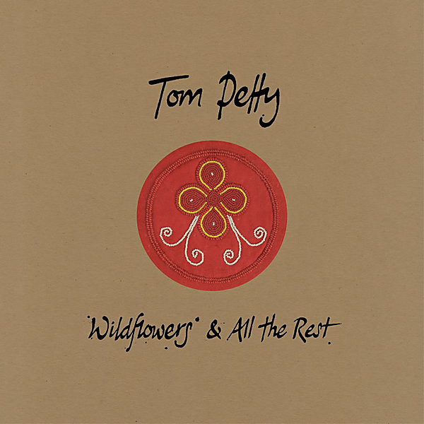

# Wildflowers & All The Rest (Deluxe Edition)

By Tom Petty

## Album Data

- Catalog #: Roon
- Format: Digital, Album

## Track listing

1. Wildflowers
2. You Don't Know How It Feels
3. Time to Move On
4. You Wreck Me
5. It's Good to Be King
6. Only a Broken Heart
7. Honey Bee
8. Don't Fade on Me
9. Hard on Me
10. Cabin Down Below
11. To Find a Friend
12. A Higher Place
13. House in the Woods
14. Crawling Back to You
15. Wake up Time
16. Something Could Happen
17. Leave Virginia Alone
18. Climb That Hill Blues
19. Confusion Wheel
20. California
21. Harry Green
22. Hope You Never
23. Somewhere Under Heaven
24. Climb That Hill
25. Hung Up and Overdue
26. There Goes Angela (Dream Away) [Home Recording]
27. You Don't Know How It Feels [Home Recording]
28. California [Home Recording]
29. A Feeling of Peace [Home Recording]
30. Leave Virginia Alone [Home Recording]
31. Crawling Back to You [Home Recording]
32. Don't Fade on Me [Home Recording]
33. Confusion Wheel [Home Recording]
34. A Higher Place [Home Recording]
35. There's a Break in the Rain (Have Love Will Travel) [Home Recording]
36. To Find a Friend [Home Recording]
37. Only a Broken Heart [Home Recording]
38. Wake Up Time [Home Recording]
39. Hung Up and Overdue [Home Recording]
40. Wildflowers [Home Recording]
41. You Don't Know How It Feels [Live]
42. Honey Bee [Live]
43. To Find a Friend [Live]
44. Walls [Live]
45. Crawling Back to You [Live]
46. Cabin Down Below [Live]
47. Drivin' Down to Georgia [Live]
48. House in the Woods [Live]
49. Girl on LSD [Live]
50. Time to Move On [Live]
51. Wake Up Time [Live]
52. It's Good to Be King [Live]
53. You Wreck Me [Live]
54. Wildflowers [Live]

