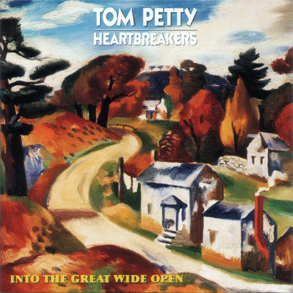

# Into The Great Wide Open

By Tom Petty & the Heartbreakers

## Album Data

- Catalog #: Roon
- Format: Digital, Album

## Track listing

1. Learning to Fly
2. Kings Highway
3. Into the Great Wide Open
4. Two Gunslingers
5. The Dark of the Sun
6. All or Nothin'
7. All the Wrong Reasons
8. Too Good to Be True
9. Out in the Cold
10. You and I Will Meet Again
11. Makin' Some Noise
12. Built to Last

## See also

- [Angel Dream (Songs and Music From The Motion Picture "She’s The One")](Angel_Dream_Songs_and_Music_From_The_Motion_Picture_She’s_The_One.md)
- [Damn The Torpedoes (Deluxe Edition)](Damn_The_Torpedoes_Deluxe_Edition.md)
- [Southern Accents](Southern_Accents.md)
- [The Live Anthology (Édition Studio Masters) (Live)](The_Live_Anthology_Édition_Studio_Masters_Live.md)
- [Tom Petty & The Heartbreakers](Tom_Petty_and_The_Heartbreakers.md)
