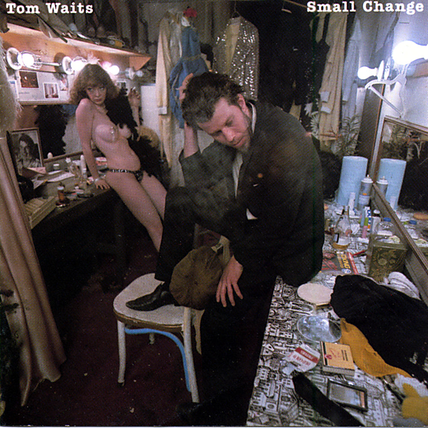

# Small Change (Remastered)

By Tom Waits

## Album Data

- Catalog #: Roon
- Format: Digital, Album

## Track listing

1. Tom Traubert's Blues (Four Sheets to the Wind in Copenhagen)
2. Step Right Up
3. Jitterbug Boy (Sharing a Curbstone with Chuck E. Weiss, Robert Marchese, Paul Body and the Mug and Artie)
4. I Wish I Was in New Orleans (In the Ninth Ward)
5. The Piano Has Been Drinking (Not Me) (An Evening with Pete King)
6. Invitation to the Blues
7. Pasties and a G‐String (At the Two O'Clock Club)
8. Bad Liver and a Broken Heart (In Lowell)
9. The One That Got Away
10. Small Change (Got Rained on with His Own.38)
11. I Can't Wait to Get Off Work (And See My Baby on Montgomery Avenue)

