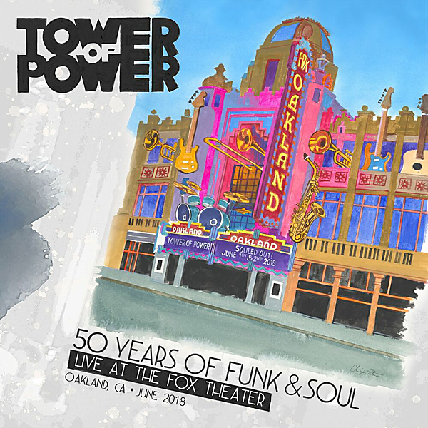

# 50 Years of Funk & Soul: Live at the Fox Theater – Oakland, CA – June 2018 (Live)

By Tower of Power

## Album Data

- Catalog #: Roon
- Format: Digital, Album

## Track listing

1-1 Stroke '75
1-2 Ain't Nothing Stopping Us Now
1-3 You Ought to Be Having Fun
1-4 Soul With a Capital S
1-5 Stop
1-6 You're So Wonderful, So Marvelous
1-7 On the Serious Side
1-8 Just When We Start Makin' It
1-9 Soul Vaccination
1-10 What Is Hip? / Soul Power
1-11 Do You Like That?
1-12 Drop It in the Slot
2-1 Can't You See (You Doin' Me Wrong)?
2-2 Maybe It'll Rub Off
2-3 Don't Change Horses
2-4 Squib Cakes
2-5 On the Soul Side of Town
2-6 Diggin' on James Brown (Medley): Diggin' on James Brown / It's a New Day / Mother Popcorn / There It Is / I Got the Feelin' / Diggin' on James Brown [reprise] [live]
2-7 So Very Hard to Go
2-8 Knock Yourself Out
2-9 You're Still a Young Man
2-10 Souled Out

