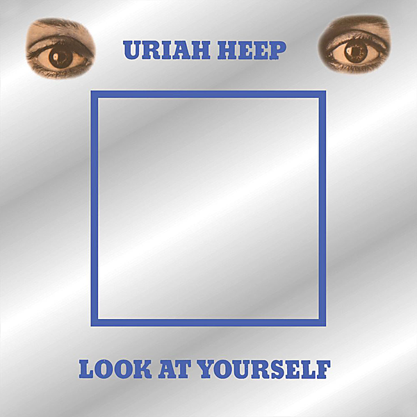

# Look At Yourself (Expanded Version)

By Uriah Heep

## Album Data

- Catalog #: Roon
- Format: Digital, Album

## Track listing

1. Look At Yourself
2. I Wanna Be Free
3. July Morning
4. Tears in My Eyes
5. Shadows of Grief
6. What Should Be Done
7. Love Machine
8. I Wanna Be Free [Alternative Mix]
9. Tears in My Eyes [Alternative Mix]
10. What Should Be Done [Alternative Mix]
11. Shadows of Grief [Alternative Mix]
12. Look at Yourself [Alternative Mix]
13. July Morning [Alternative Mix]
14. Why Fourteen Minutes [Alternative Mix]
15. Love Machine [Alternative Mix]
16. What's Within My Heart [Alternative Mix]
17. July Morning [Alternative Mix] [Live]
18. Look at Yourself [Alternative Single Version]
19. What's Within My Heart [Outtake]
20. Why [Early Version]
21. Tears in My Eyes [Extended Mix]
22. What Should Be Done [Alternate Version]
23. Look at Yourself [Live at the BBC]
24. What Should Be Done [Live at the BBC]

