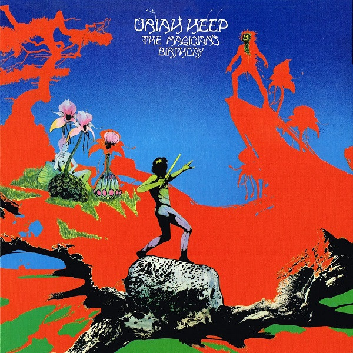

# The Magician's Birthday

By Uriah Heep

## Album Data

- Catalog #: Roon
- Format: Digital, Album

## Track listing

1. Sunrise
2. Spider Woman
3. Blind Eye
4. Echoes in the Dark
5. Rain
6. Sweet Lorraine
7. Tales
8. The Magician's Birthday

## See also

- [Demons and Wizards (Expanded Version)](Demons_and_Wizards_Expanded_Version.md)
- [Look At Yourself (Expanded Version)](Look_At_Yourself_Expanded_Version.md)
- [Travellers In Time](Travellers_In_Time-_Anthology__Vol_1.md)
- [Very 'Eavy, Very 'Umble (Expanded Version)](Very_Eavy__Very_Umble_Expanded_Version.md)
- [Beets: 20th Century Masters](../../Beets/Uriah_Heep/20th_Century_Masters.md)
- [Beets: Demons and Wizards](../../Beets/Uriah_Heep/Demons_and_Wizards.md)
- [Beets: Look at Yourself](../../Beets/Uriah_Heep/Look_at_Yourself.md)
- [Beets: The Magician’s Birthday](../../Beets/Uriah_Heep/The_Magician’s_Birthday.md)
- [Vinyl: Demons And Wizards](../../Vinyl/Uriah_Heep/Demons_And_Wizards.md)
- [Vinyl: Look At Yourself](../../Vinyl/Uriah_Heep/Look_At_Yourself.md)
- [Vinyl: The Magician's Birthday](../../Vinyl/Uriah_Heep/The_Magicians_Birthday.md)
- [Vinyl: ](../../Vinyl/Uriah_Heep/Uriah_Heep.md)
