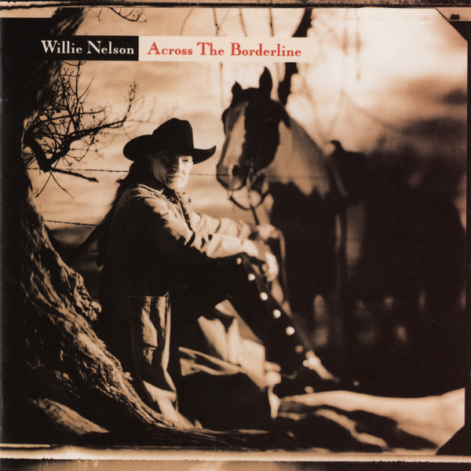

# Across The Borderline

By Willie Nelson

## Album Data

- Catalog #: Roon
- Format: Digital, Album

## Track listing

1. American Tune
2. Getting over You
3. The Most Unoriginal Sin
4. Don't Give Up
5. Heartland
6. Across the Borderline
7. Graceland
8. Farther Down the Line
9. Valentine
10. What Was It You Wanted?
11. I Love the Life I Live
12. If I Were the Man You Wanted
13. She's Not for You
14. Still Is Still Moving to Me

## See also

- [God's Problem Child](Gods_Problem_Child.md)
- [Beets: 16 Biggest Hits](../../Beets/Willie_Nelson/16_Biggest_Hits.md)
- [Beets: God’s Problem Child](../../Beets/Willie_Nelson/God’s_Problem_Child.md)
- [Beets: Red Headed Stranger](../../Beets/Willie_Nelson/Red_Headed_Stranger.md)
- [Beets: Teatro](../../Beets/Willie_Nelson/Teatro.md)
- [Vinyl: God's Problem Child](../../Vinyl/Willie_Nelson/Gods_Problem_Child.md)
- [Vinyl: ](../../Vinyl/Willie_Nelson/Willie_Nelson.md)
