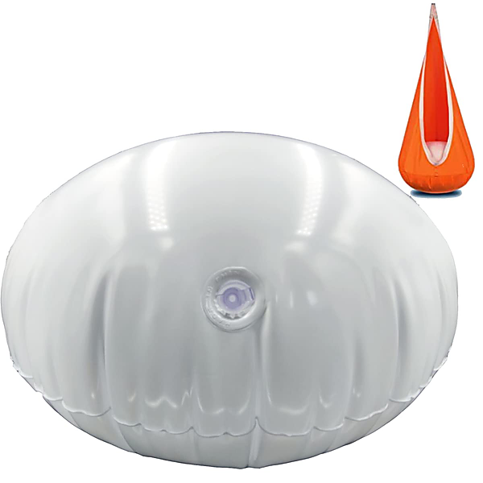

# The Exciting Wilson Pickett (Edition Studio Masters)

By Wilson Pickett

## Album Data

- Catalog #: Roon
- Format: Digital, Album

## Track listing

1. Land of 1000 Dances
2. Something You Got
3. 634-5789 (Soulsville, U.S.A.)
4. Barefootin'
5. Mercy Mercy
6. You're So Fine
7. In the Midnight Hour
8. Ninety-Nine and a Half (Won't Do)
9. Danger Zone
10. I'm Drifting
11. It's All Over
12. She's So Good to Me

## See also

- [In the Midnight Hour](In_the_Midnight_Hour.md)
- [It's Too Late](Its_Too_Late.md)
- [The Sound of Wilson Pickett](The_Sound_of_Wilson_Pickett.md)
- [The Wicked Pickett](The_Wicked_Pickett.md)
- [Beets: The Best Of Wilson Pickett](../../Beets/Wilson_Pickett/The_Best_Of_Wilson_Pickett.md)
- [Vinyl: "634-5789 (Soulsville, U.S.A.)"](../../Vinyl/Wilson_Pickett/634-5789_Soulsville__USA.md)
- [Vinyl: The Best Of Wilson Pickett](../../Vinyl/Wilson_Pickett/The_Best_Of_Wilson_Pickett.md)
- [Vinyl: ](../../Vinyl/Wilson_Pickett/Wilson_Pickett.md)
