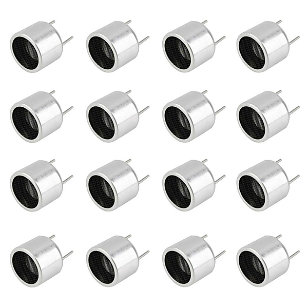

# Rachmaninov : Piano Concerto No.3 In D Minor, Op.30 - Prokofiev : Piano Concerto No.2 In G Minor, Op.16 (96 kHz / 24 Bit / Live From Caracas / 2013)

By Yuja Wang

## Album Data

- Catalog #: Roon
- Format: Digital, Album

## Track listing

1. Piano Concerto No. 3 in D minor, Op. 30: 1. Allegro ma non tanto
2. Piano Concerto No. 3 in D minor, Op. 30: 2. Intermezzo. Adagio
3. Piano Concerto No. 3 in D minor, Op. 30: 3. Finale. Alla breve
4. Piano Concerto No. 2 in G minor, Op. 16: 1. Andantino - Allegretto
5. Piano Concerto No. 2 in G minor, Op. 16: 2. Scherzo. Vivace
6. Piano Concerto No. 2 in G minor, Op. 16: 3. Intermezzo. Allegro moderato
7. Piano Concerto No. 2 in G minor, Op. 16: 4. Finale. Allegro tempestoso

