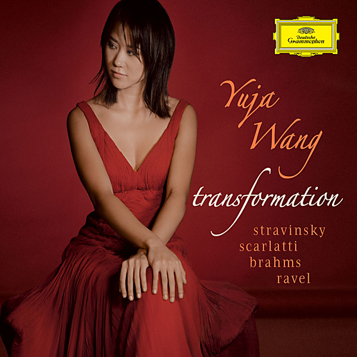

# Transformation

By Yuja Wang

## Album Data

- Catalog #: Roon
- Format: Digital, Album

## Track listing

1. Stravinsky: Petrouchka - Three Movements for Piano (1921) / Scene 1 - IV. Russian Dance
2. Stravinsky: Petrouchka - Three Movements for Piano (1921) / Scene 2 - Petrouchka's Room
3. Stravinsky: Petrouchka - Three Movements for Piano (1921) / Scene 4 - The Shrovetide Fair
4. D. Scarlatti: Sonata in E Major, K. 380 - Andante commodo
5. Brahms: Variations on a Theme by Paganini, Op. 35 / Book 1 - Thema. Non troppo presto
6. Brahms: Variations on a Theme by Paganini, Op. 35 / Book 1 - Variation I
7. Brahms: Variations on a Theme by Paganini, Op. 35 / Book 1 - Variation II
8. Brahms: Variations on a Theme by Paganini, Op. 35 / Book 1 - Variation III
9. Brahms: Variations on a Theme by Paganini, Op. 35 / Book 1 - Variation IV
10. Brahms: Variations on a Theme by Paganini, Op. 35 / Book 1 - Variation V
11. Brahms: Variations on a Theme by Paganini, Op. 35 / Book 1 - Variation VI
12. Brahms: Variations on a Theme by Paganini, Op. 35 / Book 1 - Variation VII
13. Brahms: Variations on a Theme by Paganini, Op. 35 / Book 1 - Variation VIII
14. Brahms: Variations on a Theme by Paganini, Op. 35 / Book 1 - Variation IX
15. Brahms: Variations on a Theme by Paganini, Op. 35 / Book 1 - Variation X
16. Brahms: Variations on a Theme by Paganini, Op. 35 / Book 1 - Variation XI: Andante
17. Brahms: Variations on a Theme by Paganini, Op. 35 / Book 1 - Variation XII
18. Brahms: Variations on a Theme by Paganini, Op. 35 / Book 2 - Variation I
19. Brahms: Variations on a Theme by Paganini, Op. 35 / Book 2 - Variation II: Poco animato
20. Brahms: Variations on a Theme by Paganini, Op. 35 / Book 2 - Variation V
21. Brahms: Variations on a Theme by Paganini, Op. 35 / Book 2 - Variation VI: Poco più vivace
22. Brahms: Variations on a Theme by Paganini, Op. 35 / Book 2 - Variation VII
23. Brahms: Variations on a Theme by Paganini, Op. 35 / Book 2 - Variation VIII: Allegro
24. Brahms: Variations on a Theme by Paganini, Op. 35 / Book 2 - Variation X: Feroce, energico
25. Brahms: Variations on a Theme by Paganini, Op. 35 / Book 2 - Variation XI: Vivace
26. Brahms: Variations on a Theme by Paganini, Op. 35 / Book 2 - Variation XII: Un poco Andante
27. Brahms: Variations on a Theme by Paganini, Op. 35 / Book 2 - Variation XIII: Un poco più Andante
28. Brahms: Variations on a Theme by Paganini, Op. 35 / Book 2 - Variation III
29. Brahms: Variations on a Theme by Paganini, Op. 35 / Book 2 - Variation IV: Poco Allegretto
30. Brahms: Variations on a Theme by Paganini, Op. 35 / Book 1 - Variation XIII: Vivace e scherzando
31. Brahms: Variations on a Theme by Paganini, Op. 35 / Book 1 - Variation XIV: Allegro - Presto, ma non troppo
32. D. Scarlatti: Sonata in F Minor (Andante moderato), K. 466
33. Ravel: La valse, M. 72
34. D. Scarlatti: Sonatas for Harpsichord - Sonata in G Major, K. 455: Allegro

