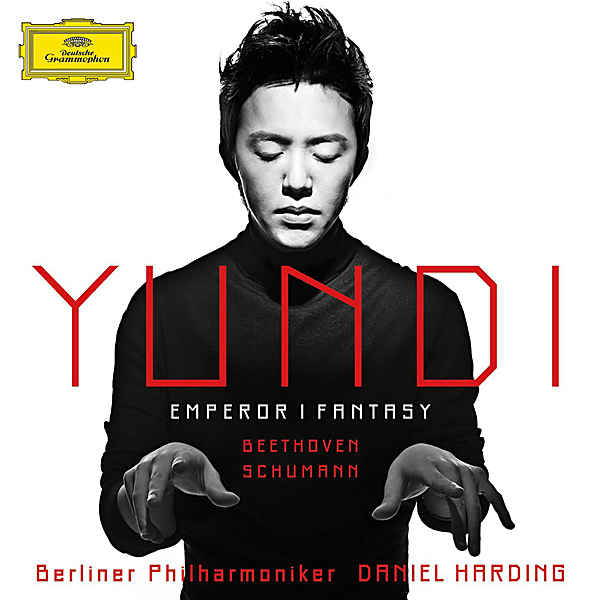

# Emperor / Fantasy (Beethoven & Schumann)

By Yundi Li

## Album Data

- Catalog #: Roon
- Format: Digital, Album

## Track listing

1. Concerto for piano & orchestra No. 5 in E flat major, op. 73 'Emperor': 1. Allegro
2. Concerto for piano & orchestra No. 5 in E flat major, op. 73 'Emperor': 2. Adagio un poco mosso - attacca:
3. Concerto for piano & orchestra No. 5 in E flat major, op. 73 'Emperor': 3. Rondo. Allegro
4. Fantasy in C major, op. 17: 1. Durchaus phantastisch und leidenschaftlich vorzutragen - Im Legendenton - Erstes Tempo
5. Fantasy in C major, Op. 17: 2. Mäßig. Durchaus energisch - Etwas langsamer - Viel bewegter
6. Fantasy in C major, op. 17: 3. Langsam getragen. Durchweg leise zu halten - Etwas bewegter

