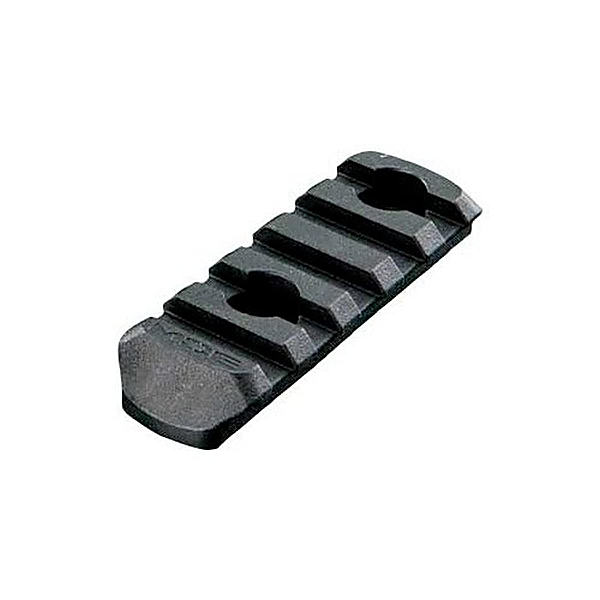

# moe - 2011-11-17

By moe.

## Album Data

- Catalog #: Roon
- Format: Digital, Album

## Track listing

1-1 Bring It Back Home >
1-2 All Roads Lead to Home >
1-3 Smoke
1-4 Tambourine
1-5 Jazz Wank >
1-6 Threw It All Away
1-7 Head >
1-8 The Pit >
1-9 Head
2-1 Time >
2-2 Timmy Tucker >
2-3 Downward Facing Dog
2-4 Sensory Deprivation Bank
2-5 So Long >
2-6 Plane Crash
2-7 Encore Break
2-8 Nebraska
2-9 Reaper

## See also

- [2011-07-20 - Artpark, Lewiston, NY](2011-07-20_-_Artpark__Lewiston__NY.md)
- [Fatboy](Fatboy.md)
- [Live at Orpheum Theatre, Boston, MA 2007-02-09](Live_at_Orpheum_Theatre__Boston__MA_2007-02-09.md)
- [Live From San Francisco](Live_From_San_Francisco.md)
- [Live From San Francisco [Vinyl Edition]](Live_From_San_Francisco_[Vinyl_Edition].md)
- [L](L.md)
- [No Doy](No_Doy.md)
- [No Guts, No Glory (Deluxe)](No_Guts__No_Glory_Deluxe.md)
- [No Guts, No Glory](No_Guts__No_Glory.md)
- [Not Normal](Not_Normal.md)
- [Sticks and Stones](Sticks_and_Stones.md)
- [The Conch](The_Conch.md)
- [tin cans & car tires](tin_cans_and_car_tires.md)
- [What Happened To The LA LA's](What_Happened_To_The_LA_LAs.md)
- [Wormwood](Wormwood.md)
