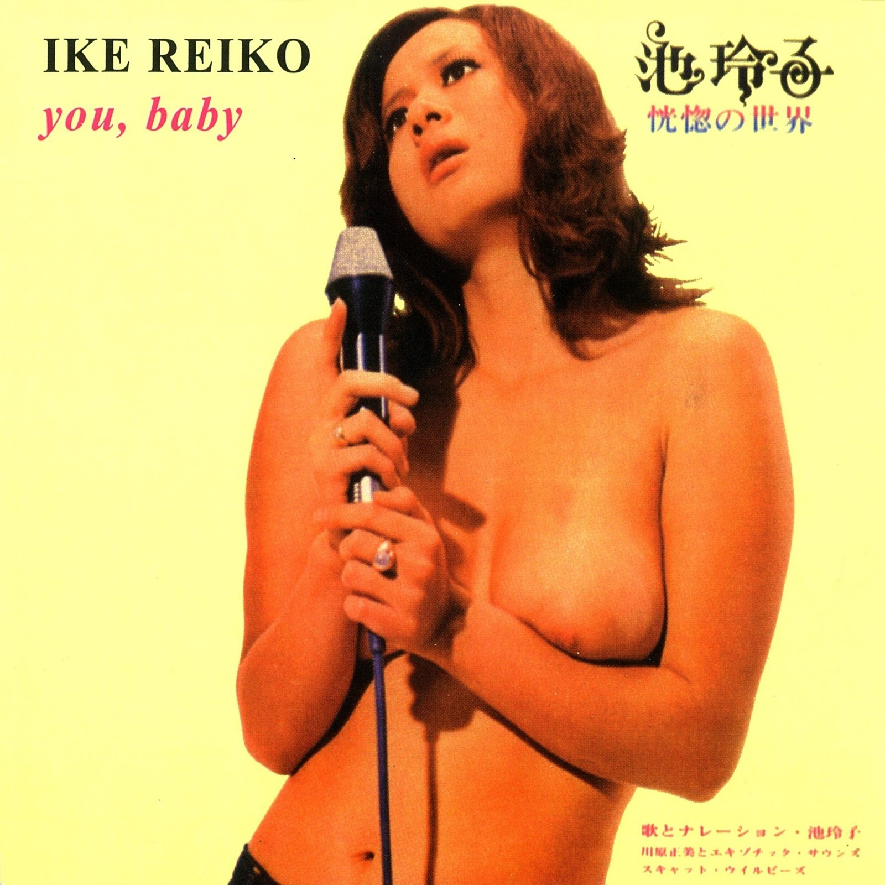

# 恍惚の世界 (you, baby)

By 池玲子 (Ike Reiko)

## Album Data

- Catalog #: Roon
- Format: Digital, Album

## Track listing

1. 女はそれをがまんできない (The Woman Cannot Help It)
2. よこはま たそがれ (It Is This Twilight)
3. めまい (Vertigo)
4. 雨がやんだら (It Stops The Rain)
5. 夜明けのスキャット (Dawn Scat)
6. さすらいのギター (Wandering Guitar)
7. 私という女 (I'm A Woman Named)
8. 雨の日のブルース (Rainy Day Blues)
9. 恋の奴隷 (Love Slave)
10. 経験 (Experience)
11. 天使になれない (Angel)
12. 愛のきずな (Chords Of Love)

